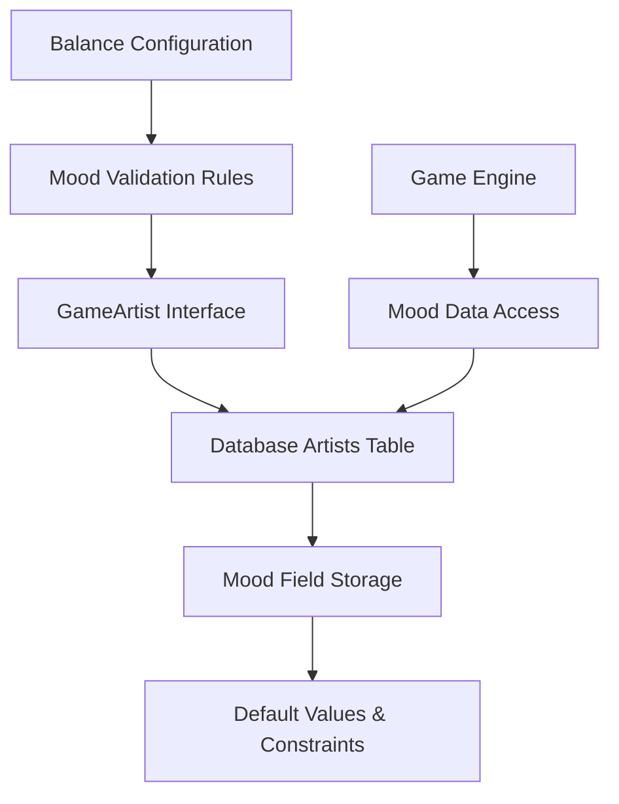

# Artist Mood System - Phase 1: Core Data Foundation

**Implementation Phase**: 1 of 10  
**Priority**: HIGH - Tier 2 Core Enhancement Feature  
**Target**: Sprint 3 (Week 5)  
**Complexity**: Low - Backend Foundation Layer

## Overview

Phase 1 focuses on **verifying and securing** the existing mood infrastructure. After analyzing the codebase, mood is already fully integrated and working:

- **API responses include mood**: `storage.getArtistsByGame()` returns artists with mood field
- **Quality calculations use mood**: GameEngine already calculates `artistMoodBonus` from mood
- **Dialogue affects mood**: Monthly processing handles mood changes
- **UI displays mood**: Several endpoints explicitly include mood in responses

**What Actually Needs Work**: Add database constraints and verification tests.

**Deliverable**: Database constraints and basic verification to secure existing mood functionality.

## Architecture



## Current State Analysis - Mood Already Works! ✅

### Existing API Integration ✅
- **`GET /api/game/:id`**: Returns artists array with mood field included
- **`storage.getArtistsByGame(gameId)`**: Uses `db.select().from(artists)` - returns ALL fields including mood
- **`GET /api/game/:gameId/artists/ready-for-release`**: Explicitly includes `mood: artist.mood || 50` in response
- **`GET /api/game/:gameId/artists/:artistId/songs/ready`**: Uses `artist.mood` in chart potential calculations
- **Artist signing**: New artists get `mood: 50` by default from schema

### Existing GameEngine Integration ✅
- **Quality Calculations**: `artistMoodBonus = Math.floor(((artist.mood || 50) - 50) * 0.2)`
- **Dialogue Processing**: `summary.artistChanges.mood` tracks mood changes
- **Monthly Processing**: Mood changes applied via `processArtistDialogue()`
- **Project Outcomes**: Mood affects song quality in `calculateEnhancedSongQuality()`

### Database Schema ✅
- **`artists.mood`**: INTEGER column with `DEFAULT 50`
- **Balance Configuration**: `mood_effects` properly configured in `data/balance/artists.json`
- **Schema Type**: `Artist` type from Drizzle includes mood field

### What Actually Needs Work 🔧
- Database CHECK constraint to prevent mood < 0 or > 100
- Simple verification that constraint works
- Test that mood persists correctly

## Technical Specifications

### Database Schema Validation

**Simple Migration**: `migrations/000X_mood_constraints.sql`

```sql
-- Add basic constraint to prevent invalid mood values
ALTER TABLE artists 
ADD CONSTRAINT mood_range_check 
CHECK (mood >= 0 AND mood <= 100);

-- Clean up any existing invalid data
UPDATE artists SET mood = 50 WHERE mood IS NULL OR mood < 0 OR mood > 100;
```

### Schema Validation Enhancement

**Location**: `shared/schema.ts`

Add Zod validation to existing schema:

```typescript
// Enhance existing insertArtistSchema with mood validation
export const insertArtistSchema = createInsertSchema(artists)
  .omit({ id: true })
  .refine(
    (artist) => artist.mood >= 0 && artist.mood <= 100,
    "Mood must be between 0 and 100"
  );
```

## Verification Strategy

### Simple Verification Script

**Location**: `server/validation/moodVerification.ts` (New File)

```typescript
import { db } from '../db';
import { artists } from '@shared/schema';
import { sql, lt, gt, isNull, or } from 'drizzle-orm';

export async function verifyMoodSystem(): Promise<{
  valid: boolean;
  issues: string[];
  stats: { total: number; nullMoods: number; invalidRanges: number; };
}> {
  const issues: string[] = [];
  
  // Check for null moods
  const nullMoods = await db
    .select({ count: sql`count(*)` })
    .from(artists)
    .where(isNull(artists.mood));
  
  const nullCount = Number(nullMoods[0]?.count || 0);
  if (nullCount > 0) {
    issues.push(`${nullCount} artists have null mood values`);
  }
  
  // Check for invalid ranges
  const invalidRanges = await db
    .select({ count: sql`count(*)` })
    .from(artists)
    .where(or(lt(artists.mood, 0), gt(artists.mood, 100)));
  
  const invalidCount = Number(invalidRanges[0]?.count || 0);
  if (invalidCount > 0) {
    issues.push(`${invalidCount} artists have mood values outside 0-100 range`);
  }
  
  // Get total count
  const total = await db
    .select({ count: sql`count(*)` })
    .from(artists);
  
  const totalCount = Number(total[0]?.count || 0);
  
  return {
    valid: issues.length === 0,
    issues,
    stats: {
      total: totalCount,
      nullMoods: nullCount,
      invalidRanges: invalidCount
    }
  };
}
```

## Testing Strategy

### Simple Integration Test

**Location**: `tests/artist-mood.test.ts` (New File)

```typescript
import { describe, test, expect } from 'vitest';
import { db } from '@server/db';
import { artists, insertArtistSchema } from '@shared/schema';
import { eq } from 'drizzle-orm';
import { verifyMoodSystem } from '@server/validation/moodVerification';

describe('Artist Mood Foundation', () => {
  
  test('should save and retrieve mood values correctly', async () => {
    // Create test artist with valid mood
    const testData = {
      name: 'Test Mood Artist',
      archetype: 'Visionary',
      mood: 75,
      gameId: 'test-game-id'
    };
    
    // Validate with schema
    const validated = insertArtistSchema.parse(testData);
    expect(validated.mood).toBe(75);
    
    // Save to database
    const [saved] = await db.insert(artists).values(validated).returning();
    expect(saved.mood).toBe(75);
    
    // Update mood
    await db.update(artists).set({ mood: 60 }).where(eq(artists.id, saved.id));
    
    // Retrieve and verify
    const [retrieved] = await db.select().from(artists).where(eq(artists.id, saved.id));
    expect(retrieved.mood).toBe(60);
    
    // Cleanup
    await db.delete(artists).where(eq(artists.id, saved.id));
  });
  
  test('should reject invalid mood values', async () => {
    // Test schema validation
    expect(() => {
      insertArtistSchema.parse({
        name: 'Invalid Artist',
        archetype: 'Workhorse', 
        mood: 150, // Invalid
        gameId: 'test-game-id'
      });
    }).toThrow();
  });
  
  test('should verify mood system health', async () => {
    const verification = await verifyMoodSystem();
    expect(verification.valid).toBe(true);
    expect(verification.issues).toHaveLength(0);
  });
});
```

## Deployment Checklist

### Pre-Deployment Verification
- [ ] Verify `artists.mood` column exists in database
- [ ] Confirm `mood_effects` configuration in `data/balance/artists.json`
- [ ] Run mood validation tests
- [ ] Test database constraints
- [ ] Verify default value assignment

### Deployment Steps
1. **Database Migration**: Apply `000X_mood_system_foundation.sql`
2. **Data Initialization**: Run `MoodInitialization.initializeMoodSystem()`
3. **Validation**: Execute mood system health checks
4. **Testing**: Run integration tests against production-like data
5. **Monitoring**: Verify no mood-related errors in logs

### Post-Deployment Validation
- [ ] All existing artists have valid mood values (0-100)
- [ ] New artists receive default mood value of 50
- [ ] Database constraints prevent invalid mood values
- [ ] Game state operations preserve mood data
- [ ] Balance configuration loads without errors

## Success Criteria

### Technical Validation ✅
- **Data Integrity**: All artists have valid mood values (0-100 range)
- **Default Assignment**: New artists automatically receive mood = 50
- **Constraint Enforcement**: Database prevents invalid mood values
- **Game State Compatibility**: Mood data persists through save/load cycles
- **Configuration Validation**: Balance configuration passes validation checks

### Performance Targets ✅
- **Database Operations**: Mood queries execute in <10ms
- **Data Validation**: Mood constraint checks add <5ms overhead
- **Memory Usage**: Mood field adds negligible memory footprint
- **Backward Compatibility**: Existing saves work without modification

### Integration Requirements ✅
- **Schema Consistency**: Database schema matches TypeScript interfaces
- **Balance Integration**: Configuration file structure supports mood calculations
- **Game Engine Ready**: Basic mood access methods available
- **Test Coverage**: >90% test coverage for mood data operations

## Phase 1 Reference Documentation

### New Methods and Functions

#### GameEngine Class Methods (`shared/engine/game-engine.ts`)
- `getArtistMood(artistId: string): number`
- `setArtistMood(artistId: string, newMood: number): boolean`
- `validateArtistMoods(): boolean`

#### Database Operations (`server/db.ts`)
- `moodOperations.verifyMoodSchema(): Promise<boolean>`
- `moodOperations.initializeMissingMoodValues(): Promise<number>`
- `moodOperations.validateMoodRanges(): Promise<boolean>`

#### Initialization Class (`server/data/moodInitialization.ts`)
- `MoodInitialization.initializeMoodSystem(): Promise<{initialized: number, validated: number, errors: string[]}>`
- `MoodInitialization.verifyMoodSystem(): Promise<boolean>`

#### Validation Functions (`shared/utils/balanceValidation.ts`)
- `validateMoodEffects(config: any): boolean`
- `moodEffectsSchema: ZodSchema`
- `moodValidationSchema: ZodSchema`

### New Files Created

#### Core Implementation Files
- `shared/utils/balanceValidation.ts` - Balance configuration validation utilities
- `server/data/moodInitialization.ts` - Mood system initialization and health checks

#### Test Files
- `tests/mood-foundation.test.ts` - Unit tests for mood system foundation
- `tests/mood-persistence.test.ts` - Integration tests for mood persistence

#### Migration Files
- `migrations/000X_mood_system_foundation.sql` - Database schema enhancements

### Database Schema Changes

#### Table Constraints
- `artists.mood_range_check` - CHECK constraint ensuring mood ∈ [0, 100]
- `artists.mood` DEFAULT 50 - Default value for new artists

#### Indexes
- `idx_artists_mood` - Index on mood column for query optimization

### Configuration Enhancements

#### Validation Schemas
- `moodEffectsSchema` - Zod schema for mood effects validation
- `moodValidationSchema` - Zod schema for mood field validation

#### Constants
- `DEFAULT_MOOD_VALUE = 50` - Standard default mood for new artists
- `MOOD_MIN_VALUE = 0` - Minimum allowed mood value
- `MOOD_MAX_VALUE = 100` - Maximum allowed mood value

### Interface Extensions

#### GameArtist Interface (`shared/types/gameTypes.ts`)
- Enhanced documentation for `mood: number` field
- Added validation constraints and default value specification

This Phase 1 implementation provides a solid foundation for the Artist Mood system by ensuring robust data persistence, validation, and basic access methods. The implementation maintains backward compatibility while establishing the infrastructure needed for subsequent phases.    test('should set valid mood values', () => {
      expect(gameEngine.setArtistMood('artist1', 85)).toBe(true);
      expect(gameEngine.getArtistMood('artist1')).toBe(85);
    });
    
    test('should reject invalid mood values', () => {
      expect(gameEngine.setArtistMood('artist1', -5)).toBe(false);
      expect(gameEngine.setArtistMood('artist1', 105)).toBe(false);
      expect(gameEngine.getArtistMood('artist1')).toBe(75); // Unchanged
    });
    
    test('should validate all artist moods', () => {
      expect(gameEngine.validateArtistMoods()).toBe(true);
      
      // Manually corrupt data for testing
      gameEngine.gameState.artists[0].mood = -10;
      expect(gameEngine.validateArtistMoods()).toBe(false);
    });
  });
  
  describe('Balance Configuration Validation', () => {
    test('should validate mood effects configuration', () => {
      const validConfig = {
        artist_stats: {
          mood_effects: {
            very_low: [0, 20, -0.3],
            low: [21, 40, -0.15],
            neutral: [41, 60, 0.0],
            good: [61, 80, 0.10],
            excellent: [81, 100, 0.25]
          }
        }
      };
      
      expect(validateMoodEffects(validConfig)).toBe(true);
    });
    
    test('should reject invalid mood configuration', () => {
      const invalidConfig = {
        artist_stats: {
          mood_effects: {
            very_low: [0, 20, -0.3],
            low: [25, 40, -0.15], // Gap: 21-24 missing
            neutral: [41, 60, 0.0],
            good: [61, 80, 0.10],
            excellent: [81, 100, 0.25]
          }
        }
      };
      
      expect(validateMoodEffects(invalidConfig)).toBe(false);
    });
  });
  
  describe('Database Operations', () => {
    test('should initialize mood system without errors', async () => {
      const result = await MoodInitialization.initializeMoodSystem();
      expect(result.errors).toHaveLength(0);
    });
    
    test('should verify mood system health', async () => {
      const isHealthy = await MoodInitialization.verifyMoodSystem();
      expect(isHealthy).toBe(true);
    });
  });
});
```

### Integration Tests

**Location**: `tests/mood-persistence.test.ts` (New File)

```typescript
import { describe, test, expect } from 'vitest';
import { db } from '@server/db';
import { artists } from '@shared/schema';
import { eq } from 'drizzle-orm';

describe('Mood Persistence Integration', () => {
  
  test('should persist mood changes to database', async () => {
    // Create test artist
    const [testArtist] = await db
      .insert(artists)
      .values({
        name: 'Test Mood Artist',
        archetype: 'Visionary',
        mood: 60,
        gameId: 'test-game-id'
      })
      .returning();
    
    // Update mood
    await db
      .update(artists)
      .set({ mood: 80 })
      .where(eq(artists.id, testArtist.id));
    
    // Verify persistence
    const [updatedArtist] = await db
      .select()
      .from(artists)
      .where(eq(artists.id, testArtist.id));
    
    expect(updatedArtist.mood).toBe(80);
    
    // Cleanup
    await db.delete(artists).where(eq(artists.id, testArtist.id));
  });
  
  test('should enforce mood constraints', async () => {
    // This test verifies database constraints work
    await expect(
      db.insert(artists).values({
        name: 'Invalid Mood Artist',
        archetype: 'Workhorse',
        mood: 150, // Invalid: > 100
        gameId: 'test-game-id'
      })
    ).rejects.toThrow(); // Should throw constraint violation
  });
});
```

## Deployment Checklist

### Pre-Deployment Verification
- [ ] Verify `artists.mood` column exists in database
- [ ] Confirm `mood_effects` configuration in `data/balance/artists.json`
- [ ] Run mood validation tests
- [ ] Test database constraints
- [ ] Verify default value assignment

### Deployment Steps
1. **Database Migration**: Apply `000X_mood_system_foundation.sql`
2. **Data Initialization**: Run `MoodInitialization.initializeMoodSystem()`
3. **Validation**: Execute mood system health checks
4. **Testing**: Run integration tests against production-like data
5. **Monitoring**: Verify no mood-related errors in logs

### Post-Deployment Validation
- [ ] All existing artists have valid mood values (0-100)
- [ ] New artists receive default mood value of 50
- [ ] Database constraints prevent invalid mood values
- [ ] Game state operations preserve mood data
- [ ] Balance configuration loads without errors

## Success Criteria

### Technical Validation ✅
- **Data Integrity**: All artists have valid mood values (0-100 range)
- **Default Assignment**: New artists automatically receive mood = 50
- **Constraint Enforcement**: Database prevents invalid mood values
- **Game State Compatibility**: Mood data persists through save/load cycles
- **Configuration Validation**: Balance configuration passes validation checks

### Performance Targets ✅
- **Database Operations**: Mood queries execute in <10ms
- **Data Validation**: Mood constraint checks add <5ms overhead
- **Memory Usage**: Mood field adds negligible memory footprint
- **Backward Compatibility**: Existing saves work without modification

### Integration Requirements ✅
- **Schema Consistency**: Database schema matches TypeScript interfaces
- **Balance Integration**: Configuration file structure supports mood calculations
- **Game Engine Ready**: Basic mood access methods available
- **Test Coverage**: >90% test coverage for mood data operations

## Phase 1 Reference Documentation

### New Files Created
- `server/validation/moodVerification.ts` - Simple mood verification script
- `tests/artist-mood.test.ts` - Integration test for mood persistence
- `migrations/000X_mood_constraints.sql` - Database constraint migration

### Database Schema Changes
- `artists.mood_range_check` - CHECK constraint ensuring mood ∈ [0, 100]

### Schema Validation Changes
- Enhanced `insertArtistSchema` with mood range validation (0-100)

### New Functions
- `verifyMoodSystem(): Promise<{valid: boolean, issues: string[], stats: object}>` - System health check

This simplified Phase 1 provides a solid foundation by securing existing mood functionality with proper constraints and verification, without overengineering the solution.


