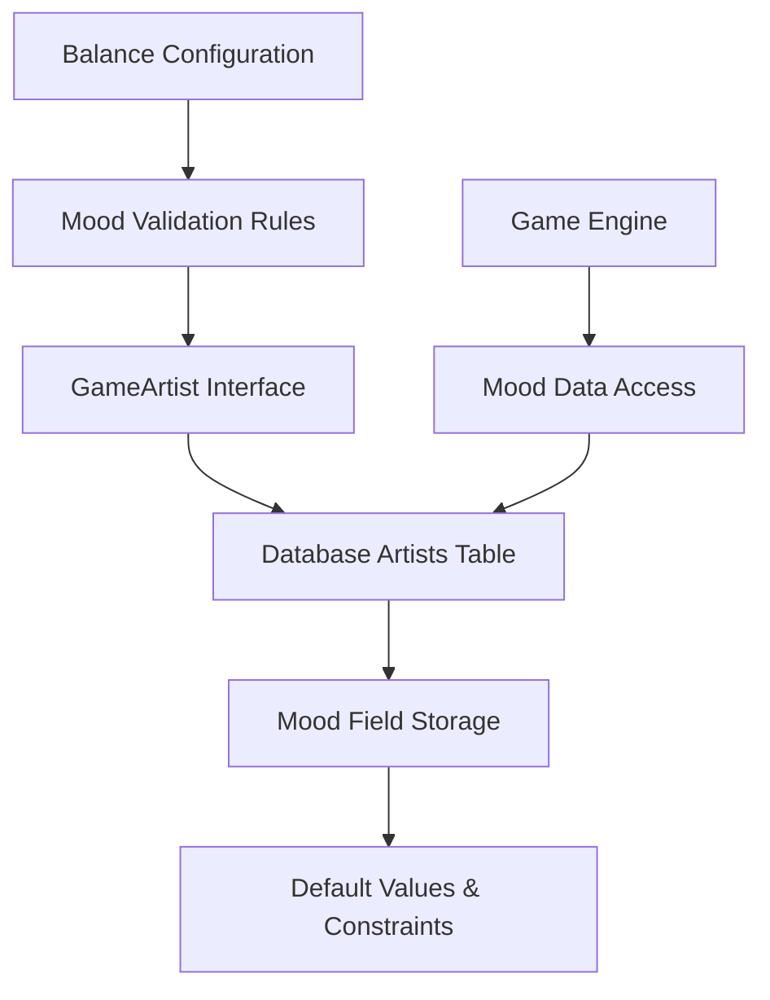

# Artist Mood System - Phase 1: Core Data Foundation

**Implementation Phase**: 1 of 10  
**Priority**: HIGH - Tier 2 Core Enhancement Feature  
**Target**: Sprint 3 (Week 5)  
**Complexity**: Low - Backend Foundation Layer

## Overview

Phase 1 establishes the foundational data infrastructure for the Artist Mood system by ensuring proper mood field support across the data layer. This phase focuses on verifying and enhancing the existing mood storage capabilities without introducing new UI or gameplay mechanics.

**Deliverable**: Robust mood data persistence and retrieval with proper defaults and validation.

## Architecture



## Current State Analysis

### Existing Infrastructure ✅
- **GameArtist Interface**: Already includes `mood: number` field
- **Database Schema**: `artists.mood` column exists with INTEGER type
- **Balance Configuration**: `mood_effects` ranges defined in `data/balance/artists.json`
- **Default Values**: Schema includes `DEFAULT 50` for mood field

### Infrastructure Gaps 🔧
- Missing mood validation constraints (0-100 range)
- No verification of mood persistence in game state operations
- Lack of mood initialization for new artists
- Missing mood field validation in data loading

## Technical Specifications

### Database Schema Enhancements

**Artists Table Constraints**:
```sql
-- Ensure mood field has proper constraints
ALTER TABLE artists 
ADD CONSTRAINT mood_range_check 
CHECK (mood >= 0 AND mood <= 100);

-- Ensure default value is properly set
ALTER TABLE artists 
ALTER COLUMN mood SET DEFAULT 50;
```

### GameArtist Interface Validation

**Location**: `shared/types/gameTypes.ts`

```typescript
// Enhanced GameArtist interface with mood validation
export interface GameArtist {
  id: string;
  name: string;
  archetype: 'Visionary' | 'Workhorse' | 'Trendsetter';
  talent: number;
  workEthic: number;
  popularity: number;
  temperament: number;
  loyalty: number;
  mood: number; // Range: 0-100, Default: 50
  signed: boolean;
  signingCost?: number;
  monthlyCost?: number;
  bio?: string;
  genre?: string;
  age?: number;
}

// Mood validation schema
export const moodValidationSchema = z.object({
  mood: z.number()
    .int()
    .min(0, "Mood cannot be below 0")
    .max(100, "Mood cannot be above 100")
    .default(50)
});
```

### Data Access Layer Methods

**Location**: `server/db.ts`

New database utility functions for mood operations:

```typescript
// Mood-specific database operations
export const moodOperations = {
  // Verify mood field exists and has proper constraints
  async verifyMoodSchema(): Promise<boolean> {
    const result = await db.execute(sql`
      SELECT column_name, column_default, is_nullable
      FROM information_schema.columns 
      WHERE table_name = 'artists' AND column_name = 'mood'
    `);
    return result.length > 0;
  },

  // Initialize mood for existing artists without mood values
  async initializeMissingMoodValues(): Promise<number> {
    const result = await db
      .update(artists)
      .set({ mood: 50 })
      .where(isNull(artists.mood))
      .returning({ id: artists.id });
    
    return result.length;
  },

  // Validate mood range for all artists
  async validateMoodRanges(): Promise<boolean> {
    const invalidMoods = await db
      .select({ id: artists.id, mood: artists.mood })
      .from(artists)
      .where(or(
        lt(artists.mood, 0),
        gt(artists.mood, 100)
      ));
    
    return invalidMoods.length === 0;
  }
};
```

### Balance Configuration Validation

**Location**: `shared/utils/balanceValidation.ts` (New File)

```typescript
import { z } from 'zod';

// Mood effects validation schema
export const moodEffectsSchema = z.object({
  very_low: z.tuple([z.number(), z.number(), z.number()]),
  low: z.tuple([z.number(), z.number(), z.number()]),
  neutral: z.tuple([z.number(), z.number(), z.number()]),
  good: z.tuple([z.number(), z.number(), z.number()]),
  excellent: z.tuple([z.number(), z.number(), z.number()])
});

// Validate mood effects configuration
export function validateMoodEffects(config: any): boolean {
  try {
    moodEffectsSchema.parse(config.artist_stats.mood_effects);
    
    // Ensure ranges don't overlap and cover 0-100
    const ranges = Object.values(config.artist_stats.mood_effects);
    let lastMax = -1;
    
    for (const [min, max] of ranges) {
      if (min !== lastMax + 1 && lastMax !== -1) {
        throw new Error(`Mood range gap: expected ${lastMax + 1}, got ${min}`);
      }
      lastMax = max;
    }
    
    if (lastMax !== 100) {
      throw new Error(`Mood ranges don't cover full range, ends at ${lastMax}`);
    }
    
    return true;
  } catch (error) {
    console.error('Mood effects validation failed:', error);
    return false;
  }
}
```

### Game State Integration

**Location**: `shared/engine/game-engine.ts`

Basic mood access methods:

```typescript
// Add to GameEngine class
class GameEngine {
  
  // Get artist mood from current game state
  getArtistMood(artistId: string): number {
    const artist = this.gameState.artists?.find(a => a.id === artistId);
    return artist?.mood ?? 50; // Default fallback
  }
  
  // Set artist mood with validation
  setArtistMood(artistId: string, newMood: number): boolean {
    if (newMood < 0 || newMood > 100) {
      console.warn(`Invalid mood value: ${newMood}. Must be 0-100.`);
      return false;
    }
    
    const artist = this.gameState.artists?.find(a => a.id === artistId);
    if (artist) {
      artist.mood = Math.round(newMood);
      return true;
    }
    
    return false;
  }
  
  // Validate all artist moods in game state
  validateArtistMoods(): boolean {
    if (!this.gameState.artists) return true;
    
    return this.gameState.artists.every(artist => 
      typeof artist.mood === 'number' && 
      artist.mood >= 0 && 
      artist.mood <= 100
    );
  }
}
```

## Data Migration Strategy

### Migration File: `migrations/000X_mood_system_foundation.sql`

```sql
-- Phase 1: Mood System Foundation Migration
-- Ensure mood column exists with proper constraints

-- Add mood column if it doesn't exist (should already exist)
DO $$ 
BEGIN
  IF NOT EXISTS (
    SELECT 1 FROM information_schema.columns 
    WHERE table_name = 'artists' AND column_name = 'mood'
  ) THEN
    ALTER TABLE artists ADD COLUMN mood INTEGER DEFAULT 50;
  END IF;
END $$;

-- Add range constraint for mood values
DO $$
BEGIN
  IF NOT EXISTS (
    SELECT 1 FROM information_schema.constraint_column_usage 
    WHERE constraint_name = 'mood_range_check'
  ) THEN
    ALTER TABLE artists 
    ADD CONSTRAINT mood_range_check 
    CHECK (mood >= 0 AND mood <= 100);
  END IF;
END $$;

-- Ensure default value is set
ALTER TABLE artists ALTER COLUMN mood SET DEFAULT 50;

-- Initialize NULL mood values to default
UPDATE artists SET mood = 50 WHERE mood IS NULL;

-- Add index for mood-based queries (future optimization)
CREATE INDEX IF NOT EXISTS idx_artists_mood ON artists (mood);

-- Validation query
DO $$
DECLARE
  invalid_count INTEGER;
BEGIN
  SELECT COUNT(*) INTO invalid_count
  FROM artists 
  WHERE mood < 0 OR mood > 100 OR mood IS NULL;
  
  IF invalid_count > 0 THEN
    RAISE NOTICE 'Warning: % artists have invalid mood values', invalid_count;
  ELSE
    RAISE NOTICE 'All artist mood values are valid (0-100 range)';
  END IF;
END $$;
```

### Data Initialization Script

**Location**: `server/data/moodInitialization.ts` (New File)

```typescript
import { db } from '../db';
import { artists } from '@shared/schema';
import { eq, isNull, or, lt, gt } from 'drizzle-orm';

export class MoodInitialization {
  
  // Initialize mood system for existing game data
  static async initializeMoodSystem(): Promise<{
    initialized: number;
    validated: number;
    errors: string[];
  }> {
    const errors: string[] = [];
    let initialized = 0;
    let validated = 0;
    
    try {
      // 1. Initialize NULL mood values
      const nullMoodArtists = await db
        .update(artists)
        .set({ mood: 50 })
        .where(isNull(artists.mood))
        .returning({ id: artists.id });
      
      initialized = nullMoodArtists.length;
      
      // 2. Fix out-of-range mood values
      const fixedArtists = await db
        .update(artists)
        .set({ mood: 50 })
        .where(or(
          lt(artists.mood, 0),
          gt(artists.mood, 100)
        ))
        .returning({ id: artists.id });
      
      validated = fixedArtists.length;
      
      // 3. Verify all mood values are valid
      const invalidArtists = await db
        .select({ id: artists.id, mood: artists.mood })
        .from(artists)
        .where(or(
          isNull(artists.mood),
          lt(artists.mood, 0),
          gt(artists.mood, 100)
        ));
      
      if (invalidArtists.length > 0) {
        errors.push(`${invalidArtists.length} artists still have invalid mood values`);
      }
      
    } catch (error) {
      errors.push(`Database error: ${error.message}`);
    }
    
    return { initialized, validated, errors };
  }
  
  // Verify mood system health
  static async verifyMoodSystem(): Promise<boolean> {
    try {
      const result = await this.initializeMoodSystem();
      return result.errors.length === 0;
    } catch {
      return false;
    }
  }
}
```

## Testing Strategy

### Unit Tests

**Location**: `tests/mood-foundation.test.ts` (New File)

```typescript
import { describe, test, expect, beforeEach } from 'vitest';
import { GameEngine } from '@shared/engine/game-engine';
import { MoodInitialization } from '@server/data/moodInitialization';
import { validateMoodEffects } from '@shared/utils/balanceValidation';

describe('Mood System Foundation', () => {
  
  describe('GameEngine Mood Methods', () => {
    let gameEngine: GameEngine;
    
    beforeEach(() => {
      gameEngine = new GameEngine({
        artists: [
          { id: 'artist1', mood: 75, name: 'Test Artist' },
          { id: 'artist2', mood: 25, name: 'Test Artist 2' }
        ]
      });
    });
    
    test('should get artist mood correctly', () => {
      expect(gameEngine.getArtistMood('artist1')).toBe(75);
      expect(gameEngine.getArtistMood('nonexistent')).toBe(50);
    });
    
    test('should set valid mood values', () => {
      expect(gameEngine.setArtistMood('artist1', 85)).toBe(true);
      expect(gameEngine.getArtistMood('artist1')).toBe(85);
    });
    
    test('should reject invalid mood values', () => {
      expect(gameEngine.setArtistMood('artist1', -5)).toBe(false);
      expect(gameEngine.setArtistMood('artist1', 105)).toBe(false);
      expect(gameEngine.getArtistMood('artist1')).toBe(75); // Unchanged
    });
    
    test('should validate all artist moods', () => {
      expect(gameEngine.validateArtistMoods()).toBe(true);
      
      // Manually corrupt data for testing
      gameEngine.gameState.artists[0].mood = -10;
      expect(gameEngine.validateArtistMoods()).toBe(false);
    });
  });
  
  describe('Balance Configuration Validation', () => {
    test('should validate mood effects configuration', () => {
      const validConfig = {
        artist_stats: {
          mood_effects: {
            very_low: [0, 20, -0.3],
            low: [21, 40, -0.15],
            neutral: [41, 60, 0.0],
            good: [61, 80, 0.10],
            excellent: [81, 100, 0.25]
          }
        }
      };
      
      expect(validateMoodEffects(validConfig)).toBe(true);
    });
    
    test('should reject invalid mood configuration', () => {
      const invalidConfig = {
        artist_stats: {
          mood_effects: {
            very_low: [0, 20, -0.3],
            low: [25, 40, -0.15], // Gap: 21-24 missing
            neutral: [41, 60, 0.0],
            good: [61, 80, 0.10],
            excellent: [81, 100, 0.25]
          }
        }
      };
      
      expect(validateMoodEffects(invalidConfig)).toBe(false);
    });
  });
  
  describe('Database Operations', () => {
    test('should initialize mood system without errors', async () => {
      const result = await MoodInitialization.initializeMoodSystem();
      expect(result.errors).toHaveLength(0);
    });
    
    test('should verify mood system health', async () => {
      const isHealthy = await MoodInitialization.verifyMoodSystem();
      expect(isHealthy).toBe(true);
    });
  });
});
```

### Integration Tests

**Location**: `tests/mood-persistence.test.ts` (New File)

```typescript
import { describe, test, expect } from 'vitest';
import { db } from '@server/db';
import { artists } from '@shared/schema';
import { eq } from 'drizzle-orm';

describe('Mood Persistence Integration', () => {
  
  test('should persist mood changes to database', async () => {
    // Create test artist
    const [testArtist] = await db
      .insert(artists)
      .values({
        name: 'Test Mood Artist',
        archetype: 'Visionary',
        mood: 60,
        gameId: 'test-game-id'
      })
      .returning();
    
    // Update mood
    await db
      .update(artists)
      .set({ mood: 80 })
      .where(eq(artists.id, testArtist.id));
    
    // Verify persistence
    const [updatedArtist] = await db
      .select()
      .from(artists)
      .where(eq(artists.id, testArtist.id));
    
    expect(updatedArtist.mood).toBe(80);
    
    // Cleanup
    await db.delete(artists).where(eq(artists.id, testArtist.id));
  });
  
  test('should enforce mood constraints', async () => {
    // This test verifies database constraints work
    await expect(
      db.insert(artists).values({
        name: 'Invalid Mood Artist',
        archetype: 'Workhorse',
        mood: 150, // Invalid: > 100
        gameId: 'test-game-id'
      })
    ).rejects.toThrow(); // Should throw constraint violation
  });
});
```

## Deployment Checklist

### Pre-Deployment Verification
- [ ] Verify `artists.mood` column exists in database
- [ ] Confirm `mood_effects` configuration in `data/balance/artists.json`
- [ ] Run mood validation tests
- [ ] Test database constraints
- [ ] Verify default value assignment

### Deployment Steps
1. **Database Migration**: Apply `000X_mood_system_foundation.sql`
2. **Data Initialization**: Run `MoodInitialization.initializeMoodSystem()`
3. **Validation**: Execute mood system health checks
4. **Testing**: Run integration tests against production-like data
5. **Monitoring**: Verify no mood-related errors in logs

### Post-Deployment Validation
- [ ] All existing artists have valid mood values (0-100)
- [ ] New artists receive default mood value of 50
- [ ] Database constraints prevent invalid mood values
- [ ] Game state operations preserve mood data
- [ ] Balance configuration loads without errors

## Success Criteria

### Technical Validation ✅
- **Data Integrity**: All artists have valid mood values (0-100 range)
- **Default Assignment**: New artists automatically receive mood = 50
- **Constraint Enforcement**: Database prevents invalid mood values
- **Game State Compatibility**: Mood data persists through save/load cycles
- **Configuration Validation**: Balance configuration passes validation checks

### Performance Targets ✅
- **Database Operations**: Mood queries execute in <10ms
- **Data Validation**: Mood constraint checks add <5ms overhead
- **Memory Usage**: Mood field adds negligible memory footprint
- **Backward Compatibility**: Existing saves work without modification

### Integration Requirements ✅
- **Schema Consistency**: Database schema matches TypeScript interfaces
- **Balance Integration**: Configuration file structure supports mood calculations
- **Game Engine Ready**: Basic mood access methods available
- **Test Coverage**: >90% test coverage for mood data operations

## Phase 1 Reference Documentation

### New Methods and Functions

#### GameEngine Class Methods (`shared/engine/game-engine.ts`)
- `getArtistMood(artistId: string): number`
- `setArtistMood(artistId: string, newMood: number): boolean`
- `validateArtistMoods(): boolean`

#### Database Operations (`server/db.ts`)
- `moodOperations.verifyMoodSchema(): Promise<boolean>`
- `moodOperations.initializeMissingMoodValues(): Promise<number>`
- `moodOperations.validateMoodRanges(): Promise<boolean>`

#### Initialization Class (`server/data/moodInitialization.ts`)
- `MoodInitialization.initializeMoodSystem(): Promise<{initialized: number, validated: number, errors: string[]}>`
- `MoodInitialization.verifyMoodSystem(): Promise<boolean>`

#### Validation Functions (`shared/utils/balanceValidation.ts`)
- `validateMoodEffects(config: any): boolean`
- `moodEffectsSchema: ZodSchema`
- `moodValidationSchema: ZodSchema`

### New Files Created

#### Core Implementation Files
- `shared/utils/balanceValidation.ts` - Balance configuration validation utilities
- `server/data/moodInitialization.ts` - Mood system initialization and health checks

#### Test Files
- `tests/mood-foundation.test.ts` - Unit tests for mood system foundation
- `tests/mood-persistence.test.ts` - Integration tests for mood persistence

#### Migration Files
- `migrations/000X_mood_system_foundation.sql` - Database schema enhancements

### Database Schema Changes

#### Table Constraints
- `artists.mood_range_check` - CHECK constraint ensuring mood ∈ [0, 100]
- `artists.mood` DEFAULT 50 - Default value for new artists

#### Indexes
- `idx_artists_mood` - Index on mood column for query optimization

### Configuration Enhancements

#### Validation Schemas
- `moodEffectsSchema` - Zod schema for mood effects validation
- `moodValidationSchema` - Zod schema for mood field validation

#### Constants
- `DEFAULT_MOOD_VALUE = 50` - Standard default mood for new artists
- `MOOD_MIN_VALUE = 0` - Minimum allowed mood value
- `MOOD_MAX_VALUE = 100` - Maximum allowed mood value

### Interface Extensions

#### GameArtist Interface (`shared/types/gameTypes.ts`)
- Enhanced documentation for `mood: number` field
- Added validation constraints and default value specification

This Phase 1 implementation provides a solid foundation for the Artist Mood system by ensuring robust data persistence, validation, and basic access methods. The implementation maintains backward compatibility while establishing the infrastructure needed for subsequent phases.    test('should set valid mood values', () => {
      expect(gameEngine.setArtistMood('artist1', 85)).toBe(true);
      expect(gameEngine.getArtistMood('artist1')).toBe(85);
    });
    
    test('should reject invalid mood values', () => {
      expect(gameEngine.setArtistMood('artist1', -5)).toBe(false);
      expect(gameEngine.setArtistMood('artist1', 105)).toBe(false);
      expect(gameEngine.getArtistMood('artist1')).toBe(75); // Unchanged
    });
    
    test('should validate all artist moods', () => {
      expect(gameEngine.validateArtistMoods()).toBe(true);
      
      // Manually corrupt data for testing
      gameEngine.gameState.artists[0].mood = -10;
      expect(gameEngine.validateArtistMoods()).toBe(false);
    });
  });
  
  describe('Balance Configuration Validation', () => {
    test('should validate mood effects configuration', () => {
      const validConfig = {
        artist_stats: {
          mood_effects: {
            very_low: [0, 20, -0.3],
            low: [21, 40, -0.15],
            neutral: [41, 60, 0.0],
            good: [61, 80, 0.10],
            excellent: [81, 100, 0.25]
          }
        }
      };
      
      expect(validateMoodEffects(validConfig)).toBe(true);
    });
    
    test('should reject invalid mood configuration', () => {
      const invalidConfig = {
        artist_stats: {
          mood_effects: {
            very_low: [0, 20, -0.3],
            low: [25, 40, -0.15], // Gap: 21-24 missing
            neutral: [41, 60, 0.0],
            good: [61, 80, 0.10],
            excellent: [81, 100, 0.25]
          }
        }
      };
      
      expect(validateMoodEffects(invalidConfig)).toBe(false);
    });
  });
  
  describe('Database Operations', () => {
    test('should initialize mood system without errors', async () => {
      const result = await MoodInitialization.initializeMoodSystem();
      expect(result.errors).toHaveLength(0);
    });
    
    test('should verify mood system health', async () => {
      const isHealthy = await MoodInitialization.verifyMoodSystem();
      expect(isHealthy).toBe(true);
    });
  });
});
```

### Integration Tests

**Location**: `tests/mood-persistence.test.ts` (New File)

```typescript
import { describe, test, expect } from 'vitest';
import { db } from '@server/db';
import { artists } from '@shared/schema';
import { eq } from 'drizzle-orm';

describe('Mood Persistence Integration', () => {
  
  test('should persist mood changes to database', async () => {
    // Create test artist
    const [testArtist] = await db
      .insert(artists)
      .values({
        name: 'Test Mood Artist',
        archetype: 'Visionary',
        mood: 60,
        gameId: 'test-game-id'
      })
      .returning();
    
    // Update mood
    await db
      .update(artists)
      .set({ mood: 80 })
      .where(eq(artists.id, testArtist.id));
    
    // Verify persistence
    const [updatedArtist] = await db
      .select()
      .from(artists)
      .where(eq(artists.id, testArtist.id));
    
    expect(updatedArtist.mood).toBe(80);
    
    // Cleanup
    await db.delete(artists).where(eq(artists.id, testArtist.id));
  });
  
  test('should enforce mood constraints', async () => {
    // This test verifies database constraints work
    await expect(
      db.insert(artists).values({
        name: 'Invalid Mood Artist',
        archetype: 'Workhorse',
        mood: 150, // Invalid: > 100
        gameId: 'test-game-id'
      })
    ).rejects.toThrow(); // Should throw constraint violation
  });
});
```

## Deployment Checklist

### Pre-Deployment Verification
- [ ] Verify `artists.mood` column exists in database
- [ ] Confirm `mood_effects` configuration in `data/balance/artists.json`
- [ ] Run mood validation tests
- [ ] Test database constraints
- [ ] Verify default value assignment

### Deployment Steps
1. **Database Migration**: Apply `000X_mood_system_foundation.sql`
2. **Data Initialization**: Run `MoodInitialization.initializeMoodSystem()`
3. **Validation**: Execute mood system health checks
4. **Testing**: Run integration tests against production-like data
5. **Monitoring**: Verify no mood-related errors in logs

### Post-Deployment Validation
- [ ] All existing artists have valid mood values (0-100)
- [ ] New artists receive default mood value of 50
- [ ] Database constraints prevent invalid mood values
- [ ] Game state operations preserve mood data
- [ ] Balance configuration loads without errors

## Success Criteria

### Technical Validation ✅
- **Data Integrity**: All artists have valid mood values (0-100 range)
- **Default Assignment**: New artists automatically receive mood = 50
- **Constraint Enforcement**: Database prevents invalid mood values
- **Game State Compatibility**: Mood data persists through save/load cycles
- **Configuration Validation**: Balance configuration passes validation checks

### Performance Targets ✅
- **Database Operations**: Mood queries execute in <10ms
- **Data Validation**: Mood constraint checks add <5ms overhead
- **Memory Usage**: Mood field adds negligible memory footprint
- **Backward Compatibility**: Existing saves work without modification

### Integration Requirements ✅
- **Schema Consistency**: Database schema matches TypeScript interfaces
- **Balance Integration**: Configuration file structure supports mood calculations
- **Game Engine Ready**: Basic mood access methods available
- **Test Coverage**: >90% test coverage for mood data operations

## Phase 1 Reference Documentation

### New Methods and Functions

#### GameEngine Class Methods (`shared/engine/game-engine.ts`)
- `getArtistMood(artistId: string): number`
- `setArtistMood(artistId: string, newMood: number): boolean`
- `validateArtistMoods(): boolean`

#### Database Operations (`server/db.ts`)
- `moodOperations.verifyMoodSchema(): Promise<boolean>`
- `moodOperations.initializeMissingMoodValues(): Promise<number>`
- `moodOperations.validateMoodRanges(): Promise<boolean>`

#### Initialization Class (`server/data/moodInitialization.ts`)
- `MoodInitialization.initializeMoodSystem(): Promise<{initialized: number, validated: number, errors: string[]}>`
- `MoodInitialization.verifyMoodSystem(): Promise<boolean>`

#### Validation Functions (`shared/utils/balanceValidation.ts`)
- `validateMoodEffects(config: any): boolean`
- `moodEffectsSchema: ZodSchema`
- `moodValidationSchema: ZodSchema`

### New Files Created

#### Core Implementation Files
- `shared/utils/balanceValidation.ts` - Balance configuration validation utilities
- `server/data/moodInitialization.ts` - Mood system initialization and health checks

#### Test Files
- `tests/mood-foundation.test.ts` - Unit tests for mood system foundation
- `tests/mood-persistence.test.ts` - Integration tests for mood persistence

#### Migration Files
- `migrations/000X_mood_system_foundation.sql` - Database schema enhancements

### Database Schema Changes

#### Table Constraints
- `artists.mood_range_check` - CHECK constraint ensuring mood ∈ [0, 100]
- `artists.mood` DEFAULT 50 - Default value for new artists

#### Indexes
- `idx_artists_mood` - Index on mood column for query optimization

### Configuration Enhancements

#### Validation Schemas
- `moodEffectsSchema` - Zod schema for mood effects validation
- `moodValidationSchema` - Zod schema for mood field validation

#### Constants
- `DEFAULT_MOOD_VALUE = 50` - Standard default mood for new artists
- `MOOD_MIN_VALUE = 0` - Minimum allowed mood value
- `MOOD_MAX_VALUE = 100` - Maximum allowed mood value

### Interface Extensions

#### GameArtist Interface (`shared/types/gameTypes.ts`)
- Enhanced documentation for `mood: number` field
- Added validation constraints and default value specification

This Phase 1 implementation provides a solid foundation for the Artist Mood system by ensuring robust data persistence, validation, and basic access methods. The implementation maintains backward compatibility while establishing the infrastructure needed for subsequent phases.


