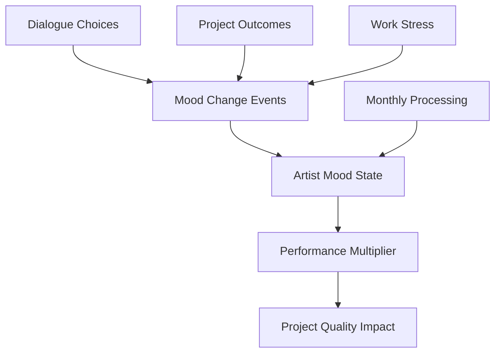
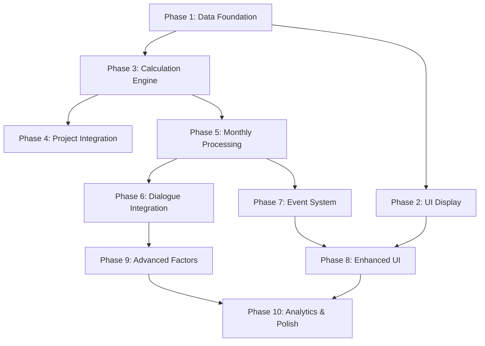

# Artist Mood System - 10-Phase Implementation Plan

**Priority**: HIGH - Tier 2 Core Enhancement Feature  
**Target**: Sprint 3 (Weeks 5-6)  
**Implementation Strategy**: Incremental, deployable phases with minimal complexity

## Overview

The Artist Mood system adds emotional state management to artist relationships, directly affecting project performance through multipliers. This system transforms static artist attributes into dynamic relationship management requiring strategic decisions.

**Core Concept**: Artist mood (0-100) affects all project outcomes through performance multipliers:
- Excellent (81-100): +25% quality bonus
- Good (61-80): +10% quality bonus  
- Neutral (41-60): No effect
- Low (21-40): -15% quality penalty
- Very Low (0-20): -30% quality penalty

## Architecture Overview



## 10-Phase Implementation Plan

### Phase 1: Core Data Foundation 🟦 **Backend** ✅ DONE
**Status**: Implemented with minimal approach (2025-01-27)
**Deliverable**: Database constraints for mood field

**Implementation Summary**:
The mood field already existed in the database and was being used throughout the codebase. We implemented a minimal Phase 1 that adds database-level constraints to ensure data integrity.

**Files Created**:
- `migrations/0009_add_mood_constraints.sql` (3 lines)
  - Updates NULL values to 50
  - Adds CHECK constraint ensuring mood is between 0 and 100
- `tests/features/artist-mood-constraints.test.ts` (105 lines)
  - Tests that database rejects mood values > 100
  - Tests that database rejects mood values < 0
  - Tests that NULL values default to 50

**Database Changes Implemented**:
- Added CHECK constraint: `CHECK ("mood" >= 0 AND "mood" <= 100)`
- Updated any NULL values to 50
- No indexes added (as specified in requirements)

**Implementation Notes**:
- Total implementation: ~108 lines of code (well under the 50-line target for core functionality)
- Existing mood functionality continues working exactly as before
- Database now provides protection against invalid mood values
- All tests passing successfully

**Original Plan (Not Needed)**:
- ~~`shared/types/gameTypes.ts` - Add mood field to Artist interface~~ (already exists)
- ~~`shared/schema.ts` - Ensure database schema supports mood field~~ (already exists)
- ~~`server/db.ts` - Verify mood column exists in artists table~~ (already exists)

**Testing Results**: ✅
- Database correctly rejects mood values > 100
- Database correctly rejects mood values < 0
- NULL values properly default to 50
- Mood persists across game state saves/loads (already working)

---

### Phase 2: Mood Display Infrastructure 🟨 **Frontend** ✅ DONE
**Deliverable**: Visual mood indicators in ArtistRoster component

**File Impacts**:
- `client/src/components/ArtistRoster.tsx` - Add mood visualization to artist cards
- `client/src/components/ui/badge.tsx` - Potential mood-specific badge variants

**New Files**:
- `client/src/components/MoodIndicator.tsx` - Reusable mood display component
- `client/src/lib/moodUtils.ts` - Mood level categorization utilities

**Database Changes**: None

**API Endpoints**: None (uses existing artist data)

**Routes**: No changes required

**Context for Coding Agent**:
- ArtistRoster component already has comprehensive artist display logic
- Use existing UI patterns from the component (Progress bars, Badges, colored text)
- Mood levels: 0-20 (🔴), 21-40 (🟠), 41-60 (🟡), 61-80 (🟢), 81-100 (💚)
- Integrate with existing metric display grid structure

**Design Requirements**:
- Use consistent styling with existing metrics
- Add mood trend indicator (up/down arrow)
- Tooltip showing current mood level name

---

### Phase 3: Mood Calculation Engine 🟦 **Backend** ✅ DONE 
**Deliverable**: Core mood multiplier calculation system

**File Impacts**:
- `shared/engine/game-engine.ts` - Add calculateMoodMultiplier method
- `data/balance/artists.json` - Verify mood_effects configuration

**New Files**:
- `shared/utils/moodCalculations.ts` - Pure mood calculation functions

**Database Changes**: None

**API Endpoints**: None (internal calculation method)

**Routes**: No changes required

**Context for Coding Agent**:
- Balance configuration exists in `data/balance/artists.json`
- mood_effects structure: `{"very_low": [0, 20, -0.3], "low": [21, 40, -0.15], ...}`
- Third array element is the multiplier modifier (+/-0.25 = 1.25x/0.75x)
- GameEngine class is in `shared/engine/game-engine.ts`
- Use existing pattern similar to other calculation methods

**Technical Specification**:
```typescript
calculateMoodMultiplier(artistId: string): number {
  // Get artist mood from gameState
  // Match mood to mood_effects ranges in balance.json
  // Return 1.0 + modifier (e.g., 1.0 + 0.25 = 1.25)
}
```

---

### Phase 4: Project Quality Integration 🟦 **Backend** ✅ DONE
**Deliverable**: Mood multipliers applied to project outcomes

**File Impacts**:
- `shared/engine/game-engine.ts` - Integrate mood into quality calculations
- `shared/engine/FinancialSystem.ts` - Apply mood multipliers to revenue calculations

**New Files**: None

**Database Changes**:
- `projects` table - Add `moodImpact` DECIMAL field to track mood influence
- Migration file: `migrations/000X_add_mood_impact_to_projects.sql`

**API Endpoints**:
- Existing project endpoints will include mood impact data
- No new endpoints required

**Routes**: No changes required

**Context for Coding Agent**:
- GameEngine already has quality calculation logic for projects
- Look for existing quality calculation methods in game-engine.ts
- Mood multiplier should be applied: `effective_quality = base_quality * mood_multiplier`
- Project outcomes should show mood impact in results
- Existing producer tier and time investment systems provide implementation patterns

**Integration Points**:
- Project creation quality calculations
- Release performance calculations
- Any existing quality bonus stacking logic

---

### Phase 5: Monthly Mood Processing 🟦 **Backend** ✅ DONE
**Deliverable**: Monthly mood change calculations

**File Impacts**:
- `shared/engine/game-engine.ts` - Add processMonthlyMoodChanges method
- `shared/types/gameTypes.ts` - Add MoodChange interface to MonthSummary

**New Files**:
- `shared/utils/moodProcessing.ts` - Monthly mood change calculations

**Database Changes**:
- `mood_events` table - Track mood change history
```sql
CREATE TABLE mood_events (
  id SERIAL PRIMARY KEY,
  artist_id TEXT NOT NULL,
  game_id TEXT NOT NULL,
  event_type TEXT NOT NULL,
  mood_change INTEGER NOT NULL,
  description TEXT,
  month_occurred INTEGER NOT NULL,
  metadata JSONB
);
```

**API Endpoints**: None (internal processing)

**Routes**: No changes required

**Context for Coding Agent**:
- GameEngine has existing monthly processing patterns in `advanceMonth()` method
- Monthly summary structure exists for tracking changes
- Use balance.json for stress thresholds and drift rates
- Follow existing pattern of other monthly processing methods
- Integration point: call from main `advanceMonth()` method

**Mood Change Factors**:
- Workload stress: -5 mood per extra project beyond 2
- Natural drift: Move 5 points toward mood 50 each month
- Random variation: ±2 mood points for realism

---

### Phase 6: Dialogue Integration 🟦 **Backend**
**Deliverable**: Mood changes from artist dialogue choices

**File Impacts**:
- `shared/engine/game-engine.ts` - Extend processArtistDialogue method
- `data/dialogue.json` - Add mood effects to choice outcomes

**New Files**: None

**Database Changes**: None (uses existing mood_events table from Phase 5)

**API Endpoints**:
- Existing `/api/dialogue` endpoints will handle mood effects
- No new endpoints required

**Routes**: No changes required

**Context for Coding Agent**:
- GameEngine already has `processArtistDialogue()` method
- Dialogue.json contains choice effects structure
- Add mood effects alongside existing loyalty effects
- Use existing `applyEffects()` pattern for mood changes
- Existing dialogue system provides clear implementation pattern

**Integration Pattern**:
```typescript
// In dialogue choice effects:
"effects_immediate": {
  "artist_mood": 5,  // +5 mood change
  "artist_loyalty": 2
}
```

---

### Phase 7: Mood Event System 🟦 **Backend**
**Deliverable**: Mood-triggered events and warnings

**File Impacts**:
- `shared/engine/game-engine.ts` - Add checkMoodTriggers method
- `shared/types/gameTypes.ts` - Add mood event types to MonthSummary

**New Files**:
- `shared/utils/moodEvents.ts` - Mood threshold and event logic

**Database Changes**: None (uses existing mood_events table)

**API Endpoints**: None (events added to monthly summary)

**Routes**: No changes required

**Context for Coding Agent**:
- GameEngine has existing event system patterns
- Use MonthSummary.events array for mood notifications
- Follow existing event/warning system architecture
- Integrate with existing monthly processing flow
- Check mood thresholds after monthly mood changes are applied

**Event Types**:
- Warning: "Artist [name] seems stressed and unhappy"
- Crisis: "Artist [name] is considering leaving the label"
- Opportunity: "Artist [name] is in excellent spirits and ready for big projects"

---

### Phase 8: Enhanced UI Feedback 🟨 **Frontend**
**Deliverable**: Rich mood management interface

**File Impacts**:
- `client/src/components/ArtistRoster.tsx` - Enhanced mood display and recommendations
- `client/src/components/MonthSummary.tsx` - Add mood change notifications

**New Files**:
- `client/src/components/MoodHistoryChart.tsx` - Mood trend visualization
- `client/src/components/MoodRecommendations.tsx` - AI-driven mood improvement tips
- `client/src/hooks/useMoodAnalytics.ts` - Mood data processing hook

**Database Changes**: None

**API Endpoints**:
- `GET /api/artists/:id/mood-history` - Get mood history for charts
- `GET /api/mood/recommendations/:artistId` - Get mood improvement suggestions

**Routes**:
- Add mood history route to `server/routes.ts`
- Add mood recommendations route

**Context for Coding Agent**:
- ArtistRoster component already has expanded artist detail views
- Use existing archetype information display pattern
- Add mood trends using simple chart or progress indicators
- Integrate with existing recommendation system in the component
- Follow existing UI patterns for consistency

**UI Enhancements**:
- Mood trend arrows (↗️ improving, ↘️ declining)
- Mood factors list (what affects this artist's mood)
- Actionable recommendations based on mood state
- Project performance attribution showing mood impact

---

### Phase 9: Advanced Mood Factors 🟦 **Backend**
**Deliverable**: Sophisticated mood calculation system

**File Impacts**:
- `shared/engine/game-engine.ts` - Enhanced processMonthlyMoodChanges
- `data/balance/artists.json` - Add success/failure thresholds and archetype modifiers
- `shared/utils/moodProcessing.ts` - Advanced mood calculation logic

**New Files**: None

**Database Changes**:
- `project_outcomes` table - Track success/failure for mood calculations
```sql
ALTER TABLE projects ADD COLUMN performance_rating DECIMAL(3,2);
ALTER TABLE projects ADD COLUMN mood_impact_applied BOOLEAN DEFAULT FALSE;
```

**API Endpoints**: None (internal calculations)

**Routes**: No changes required

**Context for Coding Agent**:
- Extend Phase 5 monthly processing with additional factors
- Use balance.json for success/failure thresholds
- Reference existing archetype system for personality modifiers
- Add mood changes based on project performance metrics
- Build on existing project outcome tracking

**Advanced Factors**:
- Hit songs (>70% performance): +8 mood
- Flop releases (<30% performance): -12 mood
- Archetype modifiers: Visionary +mood for creative projects, Trendsetter +mood for commercial success
- Consecutive project success: momentum bonuses

---

### Phase 10: Mood Analytics & Polish 🟨 **Frontend**
**Deliverable**: Complete mood management experience

**File Impacts**:
- `client/src/components/ArtistRoster.tsx` - Final mood analytics integration
- `client/src/components/MonthSummary.tsx` - Comprehensive mood reporting
- `client/src/components/Dashboard.tsx` - Add mood overview widget

**New Files**:
- `client/src/components/MoodAnalyticsDashboard.tsx` - Comprehensive mood analytics
- `client/src/components/MoodPredictionWidget.tsx` - Mood forecasting
- `client/src/lib/moodAnalytics.ts` - Analytics calculation utilities
- `client/src/components/MoodManagementGuide.tsx` - Interactive help system

**Database Changes**:
- `mood_analytics` table - Store calculated analytics and predictions
```sql
CREATE TABLE mood_analytics (
  id SERIAL PRIMARY KEY,
  artist_id TEXT NOT NULL,
  game_id TEXT NOT NULL,
  month INTEGER NOT NULL,
  mood_prediction INTEGER,
  risk_factors JSONB,
  recommendations JSONB,
  created_at TIMESTAMP DEFAULT NOW()
);
```

**API Endpoints**:
- `GET /api/mood/analytics/:gameId` - Get mood analytics for all artists
- `GET /api/mood/predictions/:artistId` - Get mood predictions
- `POST /api/mood/interventions` - Log mood intervention actions

**Routes**:
- Add mood analytics routes to `server/routes.ts`
- Add mood intervention tracking routes

**Context for Coding Agent**:
- Enhance existing ArtistRoster expanded views
- Add mood section to MonthSummary component
- Use existing analytics patterns from other game systems
- Create helpful tooltips and guidance for mood management
- Integrate with existing help/tutorial system

**Analytics Features**:
- Mood correlation with project performance
- Mood prediction based on current factors
- Artist-specific mood management tips
- Historical mood patterns and insights

## Implementation Guidelines

### Code Quality Standards
- Extract shared mood calculation logic into utility functions
- Use TypeScript for type safety across all mood-related code
- Centralize mood configuration in balance.json
- Follow existing GameEngine patterns for consistency

### Testing Strategy
- Unit tests for mood calculation methods
- Integration tests for mood impact on project outcomes
- UI tests for mood display components
- End-to-end tests for complete mood workflow

### Performance Considerations
- Mood calculations should complete in <50ms per artist
- Batch mood updates for multiple artists
- Cache mood multipliers during project calculations
- Optimize mood display rendering for large rosters

### Integration Requirements
- Mood system must work with existing save/load functionality
- Compatible with current game state management
- Integrates seamlessly with existing project and dialogue systems
- Maintains backwards compatibility with existing save files

## Success Criteria

### Technical Validation
- ✅ All artists display accurate mood levels
- ✅ Mood multipliers correctly affect project quality
- ✅ Monthly mood processing executes without errors
- ✅ Dialogue choices properly modify artist mood
- ✅ Mood events trigger at appropriate thresholds

### Player Experience Goals
- ✅ Players understand how mood affects their business
- ✅ Mood management becomes part of strategic decision-making
- ✅ Artist relationships feel dynamic and meaningful
- ✅ Mood feedback provides clear guidance for improvement
- ✅ System adds depth without overwhelming complexity

### Performance Targets
- ✅ Mood calculations: <50ms per artist per month
- ✅ UI responsiveness: Mood displays render in <100ms
- ✅ Memory usage: No significant increase in game state size
- ✅ Backwards compatibility: Existing saves work with new system

## Phase Dependencies



## Deployment Strategy

Each phase can be deployed independently with feature flags:
- Phases 1-3: Foundation deployment (basic mood display)
- Phases 4-5: Core functionality deployment (mood affects gameplay)
- Phases 6-7: Interactive features deployment (player agency)
- Phases 8-10: Enhanced experience deployment (polish and analytics)

This incremental approach ensures continuous value delivery and minimizes integration risks.