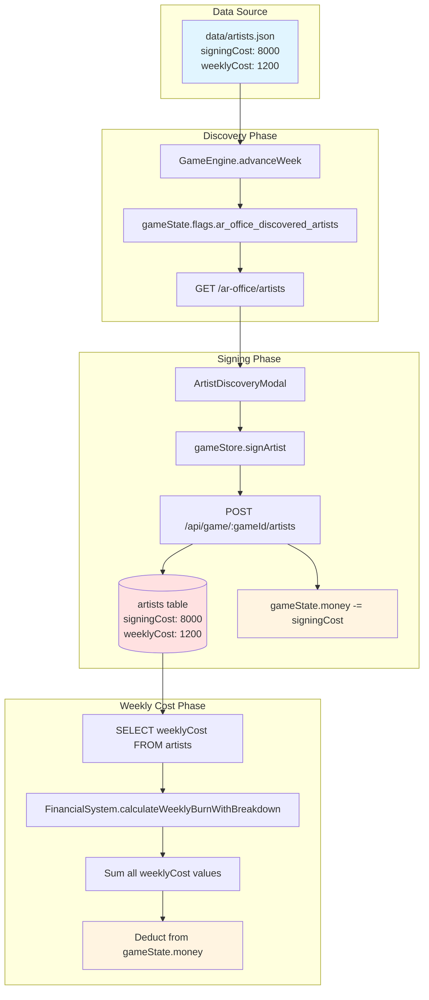
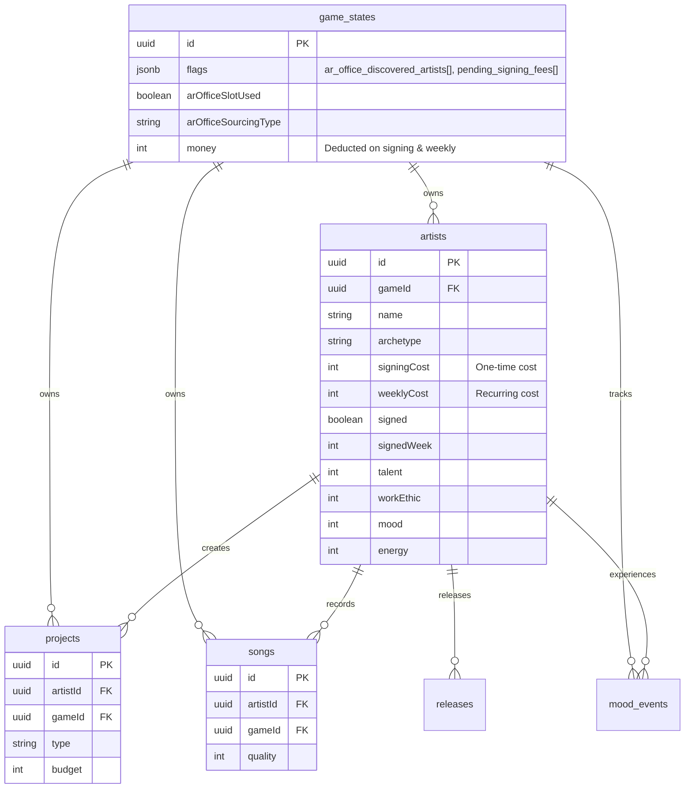

# Artist Contract System - Complete Dependency Analysis

**Document Version:** 1.0
**Created:** 2025-01-17
**Purpose:** Comprehensive dependency mapping for Artist scouting, discovery, signing, and cost systems
**Scope:** Factual analysis of existing implementation (no new feature ideation)

---

## Executive Summary

This document provides a complete dependency analysis of the Artist lifecycle systems in Music Label Manager, from discovery through signing and ongoing costs. This analysis is intended to support refactoring toward an artist contract negotiation system.

**Key Systems Analyzed:**
- Artist Discovery & Scouting (A&R Office)
- Artist Signing Flow
- Artist Cost Calculations (Signing & Weekly)
- Database Schema & Relations
- Frontend Components
- Backend API Endpoints
- Shared Types & Validation

---

## Table of Contents

1. [Database Layer](#1-database-layer)
2. [Data Sources (JSON)](#2-data-sources-json)
3. [Shared Types & Schemas](#3-shared-types--schemas)
4. [Backend API Layer](#4-backend-api-layer)
5. [Game Engine Processing](#5-game-engine-processing)
6. [Frontend Layer](#6-frontend-layer)
7. [Dependency Graph](#7-dependency-graph)
8. [Critical Integration Points](#8-critical-integration-points)
9. [Refactoring Considerations](#9-refactoring-considerations)

---

## 1. Database Layer

### 1.1 Artist Table Schema

**Location:** `shared/schema.ts:28-70`

```typescript
export const artists = pgTable("artists", {
  // Primary identification
  id: uuid("id").primaryKey().default(sql`gen_random_uuid()`),
  name: text("name").notNull(),
  gameId: uuid("game_id").references(() => gameStates.id, { onDelete: "cascade" }).notNull(),

  // Artist archetype & core attributes
  archetype: text("archetype").notNull(), // Visionary, Workhorse, Trendsetter
  genre: text("genre"),

  // Status tracking
  signed: boolean("signed").default(false),
  signedWeek: integer("signed_week"),

  // **COST FIELDS** (Critical for contract refactor)
  signingCost: integer("signing_cost"),    // One-time cost to sign artist
  weeklyCost: integer("weekly_cost").default(1200), // Ongoing weekly cost

  // Artist stats (0-100 scale)
  talent: integer("talent").default(50),
  workEthic: integer("work_ethic").default(50),
  temperament: integer("temperament"),
  mood: integer("mood").default(50),
  energy: integer("energy").default(50),
  popularity: integer("popularity").default(0),
  stress: integer("stress").default(0),
  creativity: integer("creativity").default(50),
  massAppeal: integer("mass_appeal").default(50),
  experience: integer("experience").default(0),

  // Activity tracking
  lastAttentionWeek: integer("last_attention_week").default(1),

  // Metadata
  bio: text("bio"),
  age: integer("age"),

  // Mood tracking system
  moodHistory: jsonb("mood_history").default('[]'),
  lastMoodEvent: text("last_mood_event"),
  moodTrend: integer("mood_trend").default(0), // -1, 0, 1
});
```

**Key Constraints:**
- All stat fields have CHECK constraints (0-100 range)
- `gameId` has CASCADE delete (artists deleted when game deleted)
- Indexed on `gameId` for performance

### 1.2 Related Tables

**Mood Events Table** (`shared/schema.ts:72-85`)
- Tracks artist mood changes over time
- Links to `artists.id` with CASCADE delete
- Used for mood history and analytics

**Projects Table** (`shared/schema.ts:102-138`)
- Links to `artists.id` via `artistId` field
- CASCADE delete when artist deleted

**Songs Table** (`shared/schema.ts:140-208`)
- Links to `artists.id` via `artistId` field
- CASCADE delete when artist deleted

**Game States Table** (`shared/schema.ts:265-295`)
- Stores A&R Office state in `flags` JSONB field
- `ar_office_discovered_artists` array persists discovered artists
- `pending_signing_fees` array tracks signing bonuses for week advancement

### 1.3 Database Relationships

```
gameStates (1) ──┬─── (N) artists
                 │
artists (1) ──┬─── (N) projects
              ├─── (N) songs
              ├─── (N) releases
              └─── (N) moodEvents
```

---

## 2. Data Sources (JSON)

### 2.1 Artists JSON Data

**Location:** `data/artists.json`

**Structure:**
```json
{
  "version": "0.1.0",
  "generated": "2025-08-21",
  "artists": [
    {
      "id": "art_1",
      "name": "Nova Sterling",
      "archetype": "Visionary",
      "talent": 85,
      "workEthic": 65,
      "popularity": 10,
      "temperament": 75,
      "energy": 60,
      "mood": 70,
      "signingCost": 8000,      // ← Cost data
      "weeklyCost": 1200,       // ← Cost data
      "bio": "...",
      "genre": "Pop",
      "age": 23,
      "signed": false
    }
  ]
}
```

**Usage:**
- Primary source of artist data for A&R discovery
- Loaded by `gameDataLoader` (shared/utils/dataLoader.ts)
- Filtered and returned by A&R Office endpoints
- **Cost values originate here** and are copied to database on signing

### 2.2 Balance Configuration

**Location:** `data/balance/economy.json`

Contains `talent_costs` configuration (line 76), though this appears unused in current implementation. Weekly costs come directly from artist JSON data.

---

## 3. Shared Types & Schemas

### 3.1 GameArtist Interface

**Location:** `shared/types/gameTypes.ts:2-18`

```typescript
export interface GameArtist {
  id: string;
  name: string;
  archetype: 'Visionary' | 'Workhorse' | 'Trendsetter';
  talent: number;
  workEthic: number;
  popularity: number;
  temperament: number;
  energy: number;
  mood: number;
  signed: boolean;
  signingCost?: number;      // Optional - only present before signing
  weeklyCost?: number;       // Optional - persists after signing
  bio?: string;
  genre?: string;
  age?: number;
}
```

### 3.2 Zod Validation Schema

**Location:** `shared/schemas/artist.ts:3-24`

```typescript
export const ArtistSchema = z.object({
  id: z.string(),
  name: z.string(),
  archetype: z.enum(['Visionary', 'Workhorse', 'Trendsetter']),
  mood: z.number(),
  energy: z.number(),
  popularity: z.number(),
  signedWeek: z.number().nullable().optional(),
  signed: z.boolean().optional(),
  gameId: z.string().nullable().optional(),
  talent: z.number().optional(),
  workEthic: z.number().optional(),
  temperament: z.number().optional(),
  signingCost: z.number().optional(),
  weeklyCost: z.number().optional(),
  bio: z.string().optional(),
  genre: z.string().optional(),
  age: z.number().optional()
});
```

### 3.3 API Contract Schemas

**Location:** `shared/api/contracts.ts:194-221`

```typescript
export const SignArtistRequest = z.object({
  gameId: z.string().uuid(),
  artistData: z.object({
    name: z.string().min(1).max(50),
    archetype: z.enum(['Visionary', 'Workhorse', 'Trendsetter']),
    metadata: z.record(z.any()).optional()
  })
});

export const SignArtistResponse = z.object({
  artist: ArtistSchema.pick({...}).extend({...}),
  updatedGameState: z.custom<GameState>()
});
```

---

## 4. Backend API Layer

### 4.1 Artist Discovery Endpoints

#### GET `/api/game/:gameId/ar-office/artists`

**Location:** `server/routes.ts:952-1226`

**Purpose:** Returns discovered artists from completed A&R operations

**Logic Flow:**
1. Validates game ownership
2. Checks `flags.ar_office_discovered_artists` array in game state
3. Filters out already-signed artists by name comparison
4. Returns array of discovered artists with full artist data

**Key Fields Returned:**
```typescript
{
  artists: [{
    id: string,              // Content ID from artists.json
    name: string,
    archetype: string,
    talent: number,
    popularity: number,
    genre: string,
    signingCost: number,     // ← From JSON data
    weeklyCost: number,      // ← From JSON data
    discoveryTime: number,   // Timestamp when discovered
    discoveredVia: string    // Sourcing type (active/passive/specialized)
  }],
  metadata: {
    totalDiscovered: number,
    sourcingType: string,
    discoveryTime: number
  }
}
```

**Dependencies:**
- `gameStates.flags.ar_office_discovered_artists` (JSON array)
- `storage.getGameState()`
- `storage.getArtistsByGame()` (for filtering signed artists)
- `gameDataLoader` (for full artist data enrichment)

#### POST `/api/game/:gameId/ar-office/start`

**Location:** `server/routes.ts:818-920`

**Purpose:** Initiates A&R scouting operation

**Logic Flow:**
1. Validates available focus slots
2. Sets `arOfficeSlotUsed = true`, stores sourcing type
3. Stores operation start time in `arOfficeOperationStart`
4. Updates `usedFocusSlots` count
5. Does NOT discover artists yet (happens during week advancement)

#### POST `/api/game/:gameId/ar-office/cancel`

**Location:** `server/routes.ts:900-920`

**Purpose:** Cancels active A&R operation

**Logic Flow:**
1. Sets `arOfficeSlotUsed = false`
2. Clears `arOfficeSourcingType`, `arOfficePrimaryGenre`, `arOfficeSecondaryGenre`
3. Decrements `usedFocusSlots`
4. **Keeps `ar_office_discovered_artists` array** (previous discoveries persist)

### 4.2 Artist Signing Endpoint

#### POST `/api/game/:gameId/artists`

**Location:** `server/routes.ts:1670-1792`

**Purpose:** Signs an artist to the player's roster

**Logic Flow:**

```
1. Validate game ownership and funds
   ├─ Check current gameState.money >= signingCost
   └─ Return 400 if insufficient funds

2. Prevent duplicate signings
   ├─ Get existing signed artists for game
   └─ Check name collision (case-insensitive)

3. Prepare artist data
   ├─ Parse request body with insertArtistSchema
   ├─ Set weeklyCost from request (from JSON data)
   ├─ Set gameId, signedWeek = currentWeek
   └─ Set signed = true

4. Database transaction
   ├─ storage.createArtist(validatedData)
   └─ Deduct signingCost from gameState.money

5. Track signing bonus
   ├─ Add signing event to flags.pending_signing_fees[]
   │  {
   │    artistId: string,
   │    name: string,
   │    amount: number,
   │    week: number,
   │    recordedAt: ISO timestamp
   │  }
   └─ Will be processed during week advancement

6. Clean up discovery data
   ├─ Remove from flags.ar_office_discovered_artists
   └─ Clear legacy flags if applicable

7. Generate welcome email
   ├─ Category: 'ar'
   ├─ Sender: 'Marcus "Mac" Rodriguez' (Head of A&R)
   ├─ Subject: "Artist Signed – {name}"
   └─ Body includes: artistId, name, archetype, talent, genre, signingCost, weeklyCost

8. Return created artist record
```

**Request Body:**
```typescript
{
  // From artists.json + user selection
  name: string,
  archetype: 'Visionary' | 'Workhorse' | 'Trendsetter',
  talent: number,
  workEthic: number,
  popularity: number,
  temperament: number,
  energy: number,
  mood: number,
  signingCost: number,     // ← From JSON
  weeklyCost: number,      // ← From JSON
  bio: string,
  genre: string,
  age: number,

  // Set by endpoint
  signed: true,
  signedWeek: number,
  gameId: string
}
```

**Response:**
```typescript
{
  id: string,              // Generated UUID
  name: string,
  archetype: string,
  // ... all artist fields
  signed: true,
  signedWeek: number,
  weeklyCost: number,      // ← Persisted to DB
  gameId: string
}
```

**Side Effects:**
1. **Money deduction:** `gameState.money -= signingCost`
2. **Signing fee tracking:** Added to `flags.pending_signing_fees[]`
3. **Discovery cleanup:** Removed from `flags.ar_office_discovered_artists[]`
4. **Email generation:** Welcome email created
5. **Artist count:** Implicitly tracked via artist count

---

## 5. Game Engine Processing

### 5.1 Weekly Cost Calculation

**Location:** `shared/engine/FinancialSystem.ts:1726-1794`

**Method:** `calculateWeeklyBurnWithBreakdown()`

**Logic:**
```typescript
async calculateWeeklyBurnWithBreakdown(
  gameStateId: string,
  storageOrArtistData?: any
): Promise<{
  total: number;
  baseBurn: number;
  artistCosts: number;
  artistDetails: Array<{name: string, weeklyCost: number}>;
}> {
  // 1. Calculate base operations cost (random)
  const [min, max] = this.gameData.getWeeklyBurnRangeSync();
  const baseBurn = Math.round(this.getRandom(min, max));

  // 2. Get signed artists
  const signedArtists = await storage.getArtistsByGame(gameStateId);

  // 3. Sum weekly costs
  const artistDetails = signedArtists.map(artist => ({
    name: artist.name,
    weeklyCost: artist.weeklyCost || 1200  // Default fallback
  }));

  const artistCosts = artistDetails.reduce(
    (sum, artist) => sum + artist.weeklyCost,
    0
  );

  return {
    total: baseBurn + artistCosts,
    baseBurn,
    artistCosts,
    artistDetails
  };
}
```

**Called By:**
- `GameEngine.advanceWeek()` (`shared/engine/game-engine.ts:241-244`)
- Executed during week advancement
- Results stored in `summary.expenseBreakdown.artistSalaries`

**Default Values:**
- `weeklyCost` defaults to `1200` if not set
- Constant defined: `CONSTANTS.DEFAULT_ARTIST_FEE = 1200`

### 5.2 Signing Bonus Processing

**Location:** `shared/engine/game-engine.ts` (week advancement)

**Logic Flow:**
1. During week advancement, check `flags.pending_signing_fees[]`
2. For each pending signing fee:
   ```typescript
   {
     artistId: string,
     name: string,
     amount: number,
     week: number,
     recordedAt: string
   }
   ```
3. Add to `summary.expenseBreakdown.signingBonuses`
4. Create expense change entry:
   ```typescript
   {
     type: 'expense_tracking',
     description: `Signing bonus: ${name}`,
     amount: signingCost
   }
   ```
5. Clear `flags.pending_signing_fees` after processing

### 5.3 A&R Discovery Processing

**Location:** `shared/engine/game-engine.ts:516-600` (approximate)

**Triggered:** During `advanceWeek()` if `arOfficeSlotUsed === true`

**Logic Flow:**
```
1. Check if A&R operation is active
   └─ gameState.arOfficeSlotUsed === true

2. Get operation parameters
   ├─ sourcingType: 'active' | 'passive' | 'specialized'
   ├─ primaryGenre (for specialized)
   └─ secondaryGenre (for specialized)

3. Load available artists from JSON
   ├─ gameDataLoader.loadArtists()
   └─ Filter out already signed artists

4. Apply sourcing type filters
   ├─ Active: Random selection from all unsigned
   ├─ Passive: Random selection from all unsigned
   └─ Specialized: Filter by genre, then random selection

5. Select artist(s) based on RNG
   ├─ Use seeded random from gameState.rngSeed
   └─ Select 1-3 artists (configurable)

6. Store discovered artists
   ├─ Add to flags.ar_office_discovered_artists[]
   │  {
   │    id: string,
   │    name: string,
   │    archetype: string,
   │    talent: number,
   │    popularity: number,
   │    genre: string,
   │    signingCost: number,
   │    weeklyCost: number,
   │    sourcingType: string,
   │    discoveryTime: number
   │  }
   └─ Persist to database

7. Clear operation flags
   ├─ arOfficeSlotUsed = false
   ├─ arOfficeSourcingType = null
   ├─ usedFocusSlots -= 1
   └─ Preserve ar_office_discovered_artists[] (cumulative)

8. Add to week summary
   └─ summary.arOffice = {
        completed: true,
        sourcingType: string,
        discoveredArtistId: string
      }
```

---

## 6. Frontend Layer

### 6.1 Artist Discovery Components

#### ArtistDiscoveryModal

**Location:** `client/src/components/ArtistDiscoveryModal.tsx`

**Purpose:** Main modal for browsing and signing discovered artists

**State Management:**
```typescript
const [availableArtists, setAvailableArtists] = useState<Artist[]>([]);
const [signingArtist, setSigningArtist] = useState<string | null>(null);
```

**Data Flow:**
```
1. Modal opened → fetchAvailableArtists()
   ├─ GET /api/game/:gameId/ar-office/artists
   ├─ Filter out already-signed artists
   └─ Update availableArtists state

2. User clicks "Sign" button
   ├─ Check funds: gameState.money >= artist.signingCost
   ├─ handleSignArtist(artist)
   ├─ Call onSignArtist prop (from parent)
   └─ Refresh artist list after signing

3. Display artist data
   ├─ Avatar, name, archetype badge
   ├─ Stats: talent, workEthic, popularity
   ├─ Costs: signingCost, weeklyCost
   └─ Bio (hover card)
```

**Props Interface:**
```typescript
interface ArtistDiscoveryModalProps {
  open: boolean;
  onOpenChange: (open: boolean) => void;
  gameState: GameState;
  signedArtists: any[];
  onSignArtist: (artist: Artist) => Promise<void>;
}
```

#### ArtistCard

**Location:** `client/src/components/ArtistCard.tsx`

**Purpose:** Display individual artist in roster view

**Displays:**
- Artist avatar, name, archetype
- Mood, energy, popularity meters
- Talent and work ethic stats
- **Weekly cost** (displayed in UI)

#### ArtistsLandingPage

**Location:** `client/src/pages/ArtistsLandingPage.tsx`

**Purpose:** Main artist roster management page

**Features:**
- Lists all signed artists
- Shows roster limit (3 artists max in current implementation)
- Links to individual artist pages
- Opens ArtistDiscoveryModal for signing

#### AROffice Component

**Location:** `client/src/components/ar-office/AROffice.tsx`

**Purpose:** A&R Office interface for artist scouting

**Features:**
- Start scouting operations (Active/Passive/Specialized)
- Shows operation status and timer
- Displays discovered artists count
- Opens ArtistDiscoveryModal for signing

### 6.2 Zustand Game Store

**Location:** `client/src/store/gameStore.ts`

#### Artist-Related State

```typescript
interface GameStore {
  gameState: GameState | null;
  artists: Artist[];                    // Signed artists
  discoveredArtists: Artist[];          // A&R discovered artists
  loadingDiscoveredArtists?: boolean;   // Loading flag

  // ... other state
}
```

#### Artist-Related Actions

**signArtist()**

**Location:** `client/src/store/gameStore.ts:836-871`

```typescript
signArtist: async (artistData: any) => {
  const { gameState, artists, removeDiscoveredArtist } = get();
  if (!gameState) return;

  try {
    // 1. Call signing API
    const response = await apiRequest('POST', `/api/game/${gameState.id}/artists`, {
      ...artistData,
      signedWeek: gameState.currentWeek,
      signed: true
    });
    const newArtist = await response.json();

    // 2. Update local state
    const signingCost = artistData.signingCost || 0;
    set({
      artists: [...artists, newArtist],
      gameState: {
        ...gameState,
        money: Math.max(0, (gameState.money || 0) - signingCost)
      }
    });

    // 3. Remove from discovered list
    if (artistData?.id) {
      removeDiscoveredArtist(artistData.id);
    }
  } catch (error) {
    console.error('Failed to sign artist:', error);
    throw error;
  }
}
```

**loadDiscoveredArtists()**

**Location:** `client/src/store/gameStore.ts:1099-1163`

```typescript
loadDiscoveredArtists: async () => {
  const { gameState } = get();
  if (!gameState) return;

  // Prevent concurrent requests
  if (get().loadingDiscoveredArtists) return;

  try {
    set({ loadingDiscoveredArtists: true });

    // Fetch discovered artists from API
    const res = await apiRequest('GET', `/api/game/${gameState.id}/ar-office/artists`);
    const data = await res.json();

    let artists = Array.isArray(data.artists) ? data.artists : [];

    // Fallback: Check flags for legacy data
    if (artists.length === 0 && gameState.flags) {
      const flags = gameState.flags;
      const discoveredId = flags?.ar_office_discovered_artist_id;
      const info = flags?.ar_office_discovered_artist_info || {};
      if (discoveredId) {
        artists = [{ id: discoveredId, name: info.name, ...info }];
      }
    }

    set({ discoveredArtists: artists });
  } catch (error) {
    console.error('[A&R] Failed to load discovered artists:', error);
    set({ discoveredArtists: [] });
    throw error;
  } finally {
    set({ loadingDiscoveredArtists: false });
  }
}
```

#### A&R Office Actions

**startAROfficeOperation()**

```typescript
startAROfficeOperation: async (
  sourcingType: SourcingTypeString,
  primaryGenre?: string,
  secondaryGenre?: string
) => {
  // 1. Call server API to start operation
  await arOfficeService.startAROfficeOperation(gameState.id, sourcingType, ...);

  // 2. Update local state
  await consumeAROfficeSlot(sourcingType);
}
```

**cancelAROfficeOperation()**

```typescript
cancelAROfficeOperation: async () => {
  // 1. Call server API to cancel
  await arOfficeService.cancelAROfficeOperation(gameState.id);

  // 2. Release A&R slot
  await releaseAROfficeSlot();

  // Note: Discovered artists are kept (not cleared)
}
```

---

## 7. Dependency Graph

### 7.1 Data Flow Diagram

```
┌─────────────────────────────────────────────────────────────────────────┐
│                          DATA SOURCES                                    │
│  ┌──────────────────┐           ┌──────────────────────────────────┐   │
│  │ data/artists.json│           │ data/balance/economy.json         │   │
│  │                  │           │  - talent_costs (unused)          │   │
│  │  - signingCost   │           │  - weekly_burn_base               │   │
│  │  - weeklyCost    │           │                                    │   │
│  │  - all stats     │           │                                    │   │
│  └────────┬─────────┘           └────────────────────────────────────┘   │
└───────────┼──────────────────────────────────────────────────────────────┘
            │
            ↓
┌───────────┴──────────────────────────────────────────────────────────────┐
│                      SHARED LAYER (Types & Validation)                    │
│  ┌─────────────────────────────────────────────────────────────────┐    │
│  │ shared/types/gameTypes.ts                                        │    │
│  │  - GameArtist interface                                          │    │
│  │  - GameState interface (includes A&R flags)                      │    │
│  │                                                                   │    │
│  │ shared/schemas/artist.ts                                         │    │
│  │  - ArtistSchema (Zod validation)                                 │    │
│  │                                                                   │    │
│  │ shared/api/contracts.ts                                          │    │
│  │  - SignArtistRequest / SignArtistResponse                        │    │
│  └─────────────────────────────────────────────────────────────────┘    │
└─────────────────────────────┬────────────────────────────────────────────┘
                              │
                              ↓
┌─────────────────────────────┴────────────────────────────────────────────┐
│                         DATABASE LAYER                                    │
│  ┌─────────────────────────────────────────────────────────────────┐    │
│  │ shared/schema.ts                                                 │    │
│  │  ┌────────────────────────────────────────────────────────┐     │    │
│  │  │ artists table                                           │     │    │
│  │  │  - id, name, archetype, genre                          │     │    │
│  │  │  - signed, signedWeek                                  │     │    │
│  │  │  - signingCost, weeklyCost ← COST FIELDS              │     │    │
│  │  │  - talent, workEthic, temperament, etc.               │     │    │
│  │  │  - mood, energy, popularity, stress, etc.             │     │    │
│  │  │  - gameId (FK to game_states)                         │     │    │
│  │  └────────────────────────────────────────────────────────┘     │    │
│  │                                                                   │    │
│  │  ┌────────────────────────────────────────────────────────┐     │    │
│  │  │ game_states table                                       │     │    │
│  │  │  - flags (JSONB)                                        │     │    │
│  │  │    - ar_office_discovered_artists[]                    │     │    │
│  │  │    - pending_signing_fees[]                            │     │    │
│  │  │  - arOfficeSlotUsed                                     │     │    │
│  │  │  - arOfficeSourcingType                                 │     │    │
│  │  └────────────────────────────────────────────────────────┘     │    │
│  └─────────────────────────────────────────────────────────────────┘    │
└─────────────────────────────┬────────────────────────────────────────────┘
                              │
           ┌──────────────────┴─────────────────┐
           ↓                                    ↓
┌──────────┴──────────────────┐    ┌───────────┴──────────────────────────┐
│    BACKEND API LAYER         │    │    GAME ENGINE LAYER                 │
│ ┌────────────────────────┐  │    │  ┌───────────────────────────────┐  │
│ │ server/routes.ts       │  │    │  │ shared/engine/game-engine.ts  │  │
│ │                        │  │    │  │                               │  │
│ │ GET /ar-office/artists │  │    │  │ advanceWeek()                 │  │
│ │  - Returns discovered  │  │    │  │  ├─ Process A&R operation    │  │
│ │    artists from flags  │  │    │  │  ├─ Discover new artists     │  │
│ │  - Filters signed      │  │    │  │  └─ Store in flags           │  │
│ │                        │  │    │  │                               │  │
│ │ POST /ar-office/start  │  │    │  │ shared/engine/               │  │
│ │  - Starts operation    │  │    │  │   FinancialSystem.ts          │  │
│ │  - Sets A&R flags      │  │    │  │                               │  │
│ │                        │  │    │  │ calculateWeeklyBurnWith       │  │
│ │ POST /artists          │  │    │  │   Breakdown()                 │  │
│ │  - Signs artist        │  │────┼──┼─▶ - Sums artist.weeklyCost   │  │
│ │  - Deducts money       │  │    │  │   - Adds base operations     │  │
│ │  - Tracks signing fee  │  │    │  │   - Returns total            │  │
│ │  - Removes from        │  │    │  │                               │  │
│ │    discovered list     │  │    │  └───────────────────────────────┘  │
│ │  - Generates email     │  │    │                                      │
│ └────────────────────────┘  │    └──────────────────────────────────────┘
└─────────────┬───────────────┘
              │
              ↓
┌─────────────┴───────────────────────────────────────────────────────────┐
│                        FRONTEND LAYER                                     │
│  ┌─────────────────────────────────────────────────────────────────┐    │
│  │ client/src/store/gameStore.ts                                    │    │
│  │  - artists: Artist[]                                              │    │
│  │  - discoveredArtists: Artist[]                                    │    │
│  │  - signArtist(artistData)                                         │    │
│  │  - loadDiscoveredArtists()                                        │    │
│  │  - startAROfficeOperation()                                       │    │
│  └────────────┬──────────────────────────────────────────────────────┘    │
│               │                                                            │
│               ↓                                                            │
│  ┌─────────────────────────────────────────────────────────────────┐    │
│  │ UI Components                                                     │    │
│  │  ┌──────────────────────────────────────────────────────────┐   │    │
│  │  │ ArtistDiscoveryModal.tsx                                  │   │    │
│  │  │  - Fetches discovered artists                             │   │    │
│  │  │  - Displays signingCost, weeklyCost                       │   │    │
│  │  │  - Calls signArtist()                                     │   │    │
│  │  └──────────────────────────────────────────────────────────┘   │    │
│  │  ┌──────────────────────────────────────────────────────────┐   │    │
│  │  │ AROffice.tsx                                              │   │    │
│  │  │  - Starts scouting operations                             │   │    │
│  │  │  - Shows discovered count                                 │   │    │
│  │  └──────────────────────────────────────────────────────────┘   │    │
│  │  ┌──────────────────────────────────────────────────────────┐   │    │
│  │  │ ArtistCard.tsx / ArtistsLandingPage.tsx                   │   │    │
│  │  │  - Displays artist roster                                 │   │    │
│  │  │  - Shows weeklyCost in UI                                 │   │    │
│  │  └──────────────────────────────────────────────────────────┘   │    │
│  └─────────────────────────────────────────────────────────────────┘    │
└───────────────────────────────────────────────────────────────────────────┘
```

### 7.2 Artist Signing Flow Sequence

```
User clicks "Sign" on artist in ArtistDiscoveryModal
    ↓
handleSignArtist(artist) → onSignArtist prop
    ↓
gameStore.signArtist(artistData)
    ↓
POST /api/game/:gameId/artists
    {
      name, archetype, talent, workEthic, etc.
      signingCost: 8000,    ← From JSON
      weeklyCost: 1200,     ← From JSON
      signed: true,
      signedWeek: currentWeek
    }
    ↓
server/routes.ts: POST /artists handler
    ├─ 1. Validate funds (gameState.money >= signingCost)
    ├─ 2. Check duplicate name
    ├─ 3. Parse with insertArtistSchema
    ├─ 4. storage.createArtist()
    │      ↓
    │   INSERT INTO artists (
    │     name, archetype, talent, workEthic, ...,
    │     signingCost, weeklyCost,    ← Persisted to DB
    │     signed, signedWeek, gameId
    │   )
    ├─ 5. Update gameState.money -= signingCost
    ├─ 6. Add to flags.pending_signing_fees[]
    ├─ 7. Remove from flags.ar_office_discovered_artists[]
    └─ 8. Generate welcome email
    ↓
Return newArtist record
    ↓
gameStore updates local state
    ├─ artists: [...artists, newArtist]
    ├─ gameState.money -= signingCost
    └─ removeDiscoveredArtist(artistId)
    ↓
ArtistDiscoveryModal refreshes list
    ↓
User sees artist in roster, removed from discovery modal
```

### 7.3 Weekly Cost Processing Sequence

```
User clicks "Advance Week"
    ↓
gameStore.advanceWeek()
    ↓
POST /api/advance-week
    ↓
GameEngine.advanceWeek()
    ↓
financialSystem.calculateWeeklyBurnWithBreakdown(gameStateId)
    ├─ 1. Calculate baseBurn (random from config range)
    ├─ 2. Fetch signed artists: storage.getArtistsByGame(gameId)
    │      ↓
    │   SELECT * FROM artists WHERE gameId = ? AND signed = true
    ├─ 3. Extract weeklyCost from each artist
    │      ↓
    │   artistDetails = artists.map(a => ({
    │     name: a.name,
    │     weeklyCost: a.weeklyCost || 1200
    │   }))
    ├─ 4. Sum artistCosts
    │      ↓
    │   artistCosts = artistDetails.reduce((sum, a) => sum + a.weeklyCost, 0)
    └─ 5. Return { total, baseBurn, artistCosts, artistDetails }
    ↓
Store in summary.expenseBreakdown.artistSalaries
    ↓
Process pending_signing_fees[] (if any)
    ├─ Add to summary.expenseBreakdown.signingBonuses
    └─ Clear flags.pending_signing_fees
    ↓
Deduct expenses from gameState.money
    ↓
Return week summary to client
    ↓
gameStore updates local state with new money balance
```

---

## 8. Critical Integration Points

### 8.1 Cost Data Lifecycle

```
Origin:
  data/artists.json
    ├─ signingCost: 8000
    └─ weeklyCost: 1200

Discovery Flow:
  ↓
  GameEngine processes A&R operation
    ↓
    Copies to flags.ar_office_discovered_artists[]
      ├─ signingCost: 8000    ← Preserved
      └─ weeklyCost: 1200     ← Preserved

Signing Flow:
  ↓
  Frontend fetches discovered artists
    ↓
    User selects artist
      ↓
      POST /api/game/:gameId/artists
        {
          signingCost: 8000,    ← From discovery data
          weeklyCost: 1200      ← From discovery data
        }
        ↓
        INSERT INTO artists
          ├─ signingCost: 8000     ← Persisted to DB
          └─ weeklyCost: 1200      ← Persisted to DB

Weekly Processing:
  ↓
  FinancialSystem.calculateWeeklyBurnWithBreakdown()
    ↓
    SELECT weeklyCost FROM artists WHERE gameId = ? AND signed = true
      ↓
      Sum all weeklyCost values
        ↓
        Add to weekly expenses
```

### 8.2 State Synchronization Points

**1. Discovery → Signing Transition**
- **Before:** Artist in `flags.ar_office_discovered_artists[]` (JSONB array)
- **During:** POST `/artists` endpoint
- **After:** Artist in `artists` table, removed from discovery array

**2. Signing → Weekly Cost Transition**
- **Before:** `weeklyCost` stored in `artists.weekly_cost` column
- **During:** Week advancement → `calculateWeeklyBurnWithBreakdown()`
- **After:** Cost summed and applied to `gameState.money`

**3. Frontend → Backend Sync**
- **Frontend:** `gameStore.artists` (local state)
- **Backend:** `artists` table (database)
- **Sync Points:**
  - On sign: Immediate update (POST response)
  - On load: Full refresh (GET `/game/:id`)
  - On week advance: Full refresh (GET after advance)

### 8.3 Critical Dependencies

**For Signing to Work:**
1. ✅ Valid discovered artist data in `flags.ar_office_discovered_artists[]`
2. ✅ Sufficient funds: `gameState.money >= signingCost`
3. ✅ Unique artist name (case-insensitive check)
4. ✅ Valid `gameId` (CASCADE relationship enforced)

**For Weekly Costs to Work:**
1. ✅ `artists.weeklyCost` populated (defaults to 1200 if null)
2. ✅ `artists.signed = true`
3. ✅ Valid `gameId` for artist filtering
4. ✅ Storage layer accessible during week advancement

**For A&R Discovery to Work:**
1. ✅ `data/artists.json` loaded and accessible
2. ✅ Valid `sourcingType` set in game state
3. ✅ `arOfficeSlotUsed = true` during week
4. ✅ Signed artists filtered out from available pool

---

## 9. Refactoring Considerations

### 9.1 Current Cost Model

**Characteristics:**
- **Fixed costs** stored in JSON and database
- **No negotiation** - costs are predetermined
- **No variability** - same cost for all players
- **Immediate payment** - signingCost deducted on signing
- **Weekly recurring** - weeklyCost charged every week

**Database Schema:**
```sql
artists (
  signingCost INTEGER,  -- One-time upfront cost
  weeklyCost INTEGER    -- Recurring weekly cost
)
```

### 9.2 Affected Systems for Contract Refactor

#### Database Layer
- **Schema Changes Required:**
  - New `contracts` table (or extend `artists` table)
  - Fields: contract length, payment structure, bonuses, etc.
  - Migration strategy for existing `signingCost` / `weeklyCost`

#### Data Sources
- **artists.json:**
  - Current: Fixed `signingCost` and `weeklyCost`
  - Future: Base negotiation values, contract templates?

#### Backend API
- **Endpoints Affected:**
  - POST `/artists` - Add negotiation parameters
  - GET `/ar-office/artists` - Return contract offers?
  - New: POST `/artists/:id/negotiate` endpoint?

#### Game Engine
- **FinancialSystem:**
  - `calculateWeeklyBurnWithBreakdown()` - Handle variable costs
  - New: `calculateContractPayment()` method?
  - Contract expiration logic

#### Frontend
- **Components Affected:**
  - `ArtistDiscoveryModal` - Add negotiation UI
  - `ArtistCard` - Display contract terms
  - New: `ContractNegotiationModal` component

#### State Management
- **gameStore:**
  - New contract-related state
  - New actions: `negotiateContract()`, `renewContract()`

### 9.3 Backward Compatibility Strategy

**Option 1: Dual System (Recommended)**
- Keep `signingCost` / `weeklyCost` for legacy saves
- Add new `contractId` FK for contract-based artists
- Null `contractId` = legacy fixed-cost artist

**Option 2: Migration**
- Convert all existing artists to default contract on load
- Remove `signingCost` / `weeklyCost` columns
- Higher risk, requires careful data migration

**Option 3: Feature Flag**
- Toggle between old and new systems
- Useful for gradual rollout and testing

### 9.4 Key Decision Points

1. **Contract Storage:**
   - Separate `contracts` table vs. embedded in `artists`?
   - JSONB for flexibility vs. typed columns for validation?

2. **Negotiation Complexity:**
   - Simple (1-3 options) vs. complex (full negotiation tree)?
   - Preset contracts vs. dynamic generation?

3. **Cost Calculation:**
   - Continue using `FinancialSystem` vs. new `ContractEngine`?
   - Percentage-based vs. fixed-amount contracts?

4. **Artist Discovery:**
   - Pre-negotiated offers in discovery vs. negotiate after discovery?
   - Multiple contract options vs. single take-it-or-leave-it?

5. **Existing Data:**
   - Migrate existing artists vs. legacy mode?
   - Default contract terms for current artists?

---

## 10. File Reference Index

### Database & Schema
- `shared/schema.ts:28-70` - Artists table definition
- `shared/schema.ts:265-295` - Game states table (A&R flags)
- `migrations/schema.ts` - Migration definitions

### Data Sources
- `data/artists.json` - Artist source data with costs
- `data/balance/economy.json:76` - Talent costs config (unused)

### Shared Types
- `shared/types/gameTypes.ts:2-18` - GameArtist interface
- `shared/schemas/artist.ts:3-24` - ArtistSchema validation
- `shared/api/contracts.ts:194-221` - API contracts

### Backend
- `server/routes.ts:818-920` - A&R Office start/cancel endpoints
- `server/routes.ts:952-1226` - A&R discovered artists endpoint
- `server/routes.ts:1670-1792` - Artist signing endpoint
- `server/storage.ts` - Database operations

### Game Engine
- `shared/engine/game-engine.ts:516-600` - A&R discovery processing
- `shared/engine/game-engine.ts:241-244` - Weekly cost application
- `shared/engine/FinancialSystem.ts:1726-1794` - Weekly cost calculation
- `shared/engine/EmailGenerator.ts:205-210` - Artist signing email

### Frontend
- `client/src/components/ArtistDiscoveryModal.tsx` - Discovery & signing modal
- `client/src/components/ArtistCard.tsx` - Roster artist display
- `client/src/components/ar-office/AROffice.tsx` - A&R Office UI
- `client/src/pages/ArtistsLandingPage.tsx` - Artist roster page
- `client/src/store/gameStore.ts:836-871` - signArtist action
- `client/src/store/gameStore.ts:1099-1163` - loadDiscoveredArtists action

---

## Appendix A: Cost Flow Mermaid Diagram



---

## Appendix B: Database Relationships Diagram



---

## Document Metadata

**Author:** Claude (Anthropic)
**Created:** 2025-01-17
**Purpose:** Pre-refactor dependency analysis
**Status:** Complete ✅
**Next Steps:** Review with development team, create refactor implementation plan

**Related Documents:**
- `docs/02-architecture/database-design.md`
- `docs/02-architecture/api-design.md`
- `docs/04-frontend/frontend-architecture.md`

---

**End of Document**
