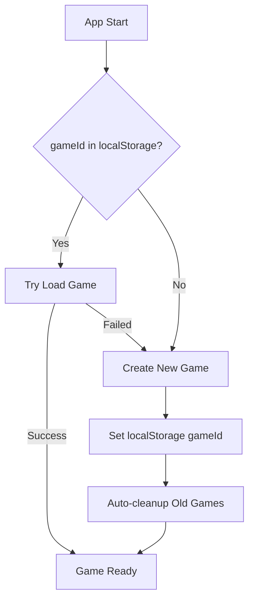

# Database Design

**Music Label Manager - Database Architecture**  
*System Design Document*

---

## 🗃️ Database Overview

The Music Label Manager uses **PostgreSQL** with **Drizzle ORM** for type-safe database operations. The schema is designed for flexibility, scalability, and data integrity.

**Key Design Principles**:
- **UUID Primary Keys**: Distributed system compatibility and security
- **JSONB Storage**: Flexible data for evolving game mechanics
- **Foreign Key Integrity**: Strict relationships between entities
- **Transaction Safety**: Atomic operations for complex game state changes

---

## 📊 Schema Design

### **Core Tables**

#### **users** - User Authentication
```sql
CREATE TABLE users (
  id UUID PRIMARY KEY DEFAULT gen_random_uuid(),
  username VARCHAR(255) UNIQUE NOT NULL,
  password_hash VARCHAR(255) NOT NULL,
  created_at TIMESTAMP DEFAULT CURRENT_TIMESTAMP,
  updated_at TIMESTAMP DEFAULT CURRENT_TIMESTAMP
);

CREATE INDEX idx_users_username ON users(username);
```

**Purpose**: User authentication and account management  
**Key Features**: Bcrypt password hashing, unique usernames, audit timestamps

#### **game_states** - Core Game Session Data
```sql
CREATE TABLE game_states (
  id UUID PRIMARY KEY DEFAULT gen_random_uuid(),
  user_id UUID NOT NULL REFERENCES users(id) ON DELETE CASCADE,
  
  -- Game Progress
  current_month INTEGER DEFAULT 1,
  campaign_completed BOOLEAN DEFAULT FALSE,
  campaign_type VARCHAR(50) DEFAULT 'standard',
  
  -- Resources
  money INTEGER DEFAULT 500000,
  reputation INTEGER DEFAULT 10,
  creative_capital INTEGER DEFAULT 15,
  focus_slots INTEGER DEFAULT 2,
  used_focus_slots INTEGER DEFAULT 0,
  
  -- Access Tiers
  playlist_access VARCHAR(50) DEFAULT 'None',
  press_access VARCHAR(50) DEFAULT 'None',
  venue_access VARCHAR(50) DEFAULT 'None',
  
  -- Flexible Data
  flags JSONB DEFAULT '{}',
  monthly_stats JSONB DEFAULT '{}',
  
  -- Audit
  created_at TIMESTAMP DEFAULT CURRENT_TIMESTAMP,
  updated_at TIMESTAMP DEFAULT CURRENT_TIMESTAMP
);

CREATE INDEX idx_game_states_user_id ON game_states(user_id);
CREATE INDEX idx_game_states_current_month ON game_states(current_month);
```

**Purpose**: Central game state management  
**Key Features**: Resource management, access tier progression, flexible JSONB for game flags

#### **artists** - Music Artists
```sql
CREATE TABLE artists (
  id UUID PRIMARY KEY DEFAULT gen_random_uuid(),
  game_id UUID NOT NULL REFERENCES game_states(id) ON DELETE CASCADE,
  
  -- Identity
  name VARCHAR(255) NOT NULL,
  archetype VARCHAR(100) NOT NULL, -- 'Visionary', 'Workhorse', 'Trendsetter'
  genre VARCHAR(255),
  
  -- Stats
  talent INTEGER DEFAULT 50,
  loyalty INTEGER DEFAULT 50,
  mood INTEGER DEFAULT 50,
  popularity INTEGER DEFAULT 0,
  
  -- Economic Data
  signing_cost INTEGER DEFAULT 0,
  monthly_cost INTEGER DEFAULT 1200,
  signed_month INTEGER DEFAULT 1,
  is_signed BOOLEAN DEFAULT TRUE,
  
  -- Flexible Data
  traits JSONB DEFAULT '[]',
  history JSONB DEFAULT '[]',
  
  -- Audit
  created_at TIMESTAMP DEFAULT CURRENT_TIMESTAMP,
  updated_at TIMESTAMP DEFAULT CURRENT_TIMESTAMP
);

CREATE INDEX idx_artists_game_id ON artists(game_id);
CREATE INDEX idx_artists_archetype ON artists(archetype);
CREATE INDEX idx_artists_signed_month ON artists(signed_month);
```

**Purpose**: Artist roster management and relationship tracking  
**Key Features**: Multi-archetype system, mood/loyalty mechanics, economic modeling

#### **projects** - Music Production Projects
```sql
CREATE TABLE projects (
  id UUID PRIMARY KEY DEFAULT gen_random_uuid(),
  game_id UUID NOT NULL REFERENCES game_states(id) ON DELETE CASCADE,
  artist_id UUID REFERENCES artists(id) ON DELETE SET NULL,
  
  -- Project Identity
  title VARCHAR(255) NOT NULL,
  type VARCHAR(100) NOT NULL, -- 'single', 'ep', 'mini-tour'
  genre VARCHAR(255),
  
  -- Production Data
  stage VARCHAR(100) DEFAULT 'planning', -- 'planning', 'production', 'marketing', 'released'
  quality INTEGER DEFAULT 0,
  budget INTEGER DEFAULT 0,
  budget_used INTEGER DEFAULT 0,
  
  -- Economic Decision Fields
  budget_per_song INTEGER DEFAULT 0,
  producer_tier TEXT DEFAULT 'local',     -- local|regional|national|legendary  
  time_investment TEXT DEFAULT 'standard', -- rushed|standard|extended|perfectionist
  total_cost INTEGER DEFAULT 0,
  song_count INTEGER DEFAULT 1,
  songs_created INTEGER DEFAULT 0,
  
  -- Timeline
  start_month INTEGER NOT NULL,
  due_month INTEGER,
  completed_month INTEGER,
  
  -- Results
  streams INTEGER DEFAULT 0,
  revenue INTEGER DEFAULT 0,
  press_pickups INTEGER DEFAULT 0,
  
  -- Flexible Data
  metadata JSONB DEFAULT '{}',
  
  -- Audit
  created_at TIMESTAMP DEFAULT CURRENT_TIMESTAMP,
  updated_at TIMESTAMP DEFAULT CURRENT_TIMESTAMP
);

CREATE INDEX idx_projects_game_id ON projects(game_id);
CREATE INDEX idx_projects_artist_id ON projects(artist_id);
CREATE INDEX idx_projects_stage ON projects(stage);
CREATE INDEX idx_projects_start_month ON projects(start_month);
```

**Purpose**: Music production lifecycle management with economic decisions  
**Key Features**: Multi-stage progression, budget tracking, performance metrics

#### **songs** - Individual Track Records
```sql
CREATE TABLE songs (
  id UUID PRIMARY KEY DEFAULT gen_random_uuid(),
  game_id UUID NOT NULL REFERENCES game_states(id) ON DELETE CASCADE,
  artist_id UUID NOT NULL REFERENCES artists(id) ON DELETE CASCADE,
  
  -- Song Identity
  title VARCHAR(255) NOT NULL,
  genre VARCHAR(100),
  mood VARCHAR(100), -- upbeat, melancholic, aggressive, chill
  
  -- Production Data
  quality INTEGER NOT NULL, -- 20-100 scale
  producer_tier TEXT DEFAULT 'local',
  time_investment TEXT DEFAULT 'standard',
  created_month INTEGER,
  
  -- Status Tracking
  is_recorded BOOLEAN DEFAULT FALSE,
  is_released BOOLEAN DEFAULT FALSE,
  release_id UUID REFERENCES releases(id),
  
  -- Revenue Tracking
  initial_streams INTEGER DEFAULT 0,
  total_streams INTEGER DEFAULT 0,
  total_revenue INTEGER DEFAULT 0,
  monthly_streams INTEGER DEFAULT 0,
  last_month_revenue INTEGER DEFAULT 0,
  release_month INTEGER,
  
  -- Flexible Data
  metadata JSONB DEFAULT '{}',
  
  -- Audit
  created_at TIMESTAMP DEFAULT CURRENT_TIMESTAMP
);

CREATE INDEX idx_songs_artist_id ON songs(artist_id);
CREATE INDEX idx_songs_game_id ON songs(game_id);
CREATE INDEX idx_songs_is_recorded ON songs(is_recorded);
CREATE INDEX idx_songs_is_released ON songs(is_released);
CREATE INDEX idx_songs_revenue ON songs(total_revenue) WHERE is_released = true;
CREATE INDEX idx_songs_release_month ON songs(release_month) WHERE is_released = true;
```

**Purpose**: Individual song tracking with revenue and streaming metrics  
**Key Features**: Quality calculation, streaming revenue decay, release association

#### **releases** - Singles, EPs, Albums
```sql
CREATE TABLE releases (
  id UUID PRIMARY KEY DEFAULT gen_random_uuid(),
  game_id UUID NOT NULL REFERENCES game_states(id) ON DELETE CASCADE,
  artist_id UUID NOT NULL REFERENCES artists(id) ON DELETE CASCADE,
  
  -- Release Identity
  title VARCHAR(255) NOT NULL,
  type VARCHAR(100) NOT NULL, -- single, ep, album, compilation
  release_month INTEGER,
  
  -- Performance Data
  total_quality INTEGER DEFAULT 0,
  marketing_budget INTEGER DEFAULT 0,
  status VARCHAR(100) DEFAULT 'planned', -- planned, released, catalog
  revenue_generated INTEGER DEFAULT 0,
  streams_generated INTEGER DEFAULT 0,
  peak_chart_position INTEGER,
  
  -- Flexible Data
  metadata JSONB DEFAULT '{}',
  
  -- Audit
  created_at TIMESTAMP DEFAULT CURRENT_TIMESTAMP
);

CREATE INDEX idx_releases_game_id ON releases(game_id);
CREATE INDEX idx_releases_artist_id ON releases(artist_id);
CREATE INDEX idx_releases_type ON releases(type);
```

**Purpose**: Release management and performance tracking  
**Key Features**: Multi-format releases, marketing integration, chart performance

#### **release_songs** - Song-Release Relationships
```sql
CREATE TABLE release_songs (
  release_id UUID NOT NULL REFERENCES releases(id) ON DELETE CASCADE,
  song_id UUID NOT NULL REFERENCES songs(id) ON DELETE CASCADE,
  track_number INTEGER NOT NULL,
  is_single BOOLEAN DEFAULT FALSE,
  
  PRIMARY KEY (release_id, song_id)
);

CREATE INDEX idx_release_songs_release_id ON release_songs(release_id);
CREATE INDEX idx_release_songs_song_id ON release_songs(song_id);
```

**Purpose**: Many-to-many relationship between songs and releases  
**Key Features**: Track ordering, single designation

#### **monthly_actions** - Player Action History
```sql
CREATE TABLE monthly_actions (
  id UUID PRIMARY KEY DEFAULT gen_random_uuid(),
  game_id UUID NOT NULL REFERENCES game_states(id) ON DELETE CASCADE,
  
  -- Action Context
  month INTEGER NOT NULL,
  action_type VARCHAR(100) NOT NULL, -- 'role_meeting', 'start_project', 'marketing', etc.
  
  -- Action Target
  target_id UUID, -- References artists, projects, or NULL for general actions
  choice_id UUID, -- For dialogue choices
  
  -- Action Results
  results JSONB DEFAULT '{}',
  
  -- Audit
  created_at TIMESTAMP DEFAULT CURRENT_TIMESTAMP
);

CREATE INDEX idx_monthly_actions_game_id ON monthly_actions(game_id);
CREATE INDEX idx_monthly_actions_month ON monthly_actions(month);
CREATE INDEX idx_monthly_actions_type ON monthly_actions(action_type);
```

**Purpose**: Player action tracking and history  
**Key Features**: Choice recording, result tracking, temporal organization

### **Supporting Tables**

#### **game_saves** - Save Game System
```sql
CREATE TABLE game_saves (
  id UUID PRIMARY KEY DEFAULT gen_random_uuid(),
  user_id UUID NOT NULL REFERENCES users(id) ON DELETE CASCADE,
  name VARCHAR(255) NOT NULL,
  game_state JSONB NOT NULL,
  month INTEGER NOT NULL,
  is_autosave BOOLEAN DEFAULT FALSE,
  created_at TIMESTAMP DEFAULT CURRENT_TIMESTAMP,
  updated_at TIMESTAMP DEFAULT CURRENT_TIMESTAMP
);

CREATE INDEX idx_game_saves_user_id ON game_saves(user_id);
CREATE INDEX idx_game_saves_created_at ON game_saves(created_at);
```

**Purpose**: Game save/load functionality  
**Key Features**: Named saves, autosave support, complete game state serialization

---

## 🔗 Relationships and Constraints

### **Primary Relationships**
```
users (1) ──── (n) game_states
game_states (1) ──── (n) artists
game_states (1) ──── (n) projects
artists (1) ──── (n) projects
artists (1) ──── (n) songs
releases (n) ──── (n) songs [via release_songs]
game_states (1) ──── (n) monthly_actions
```

### **Key Constraints**
- **Cascading Deletes**: Game deletion removes all associated data
- **Set Null**: Artist deletion preserves project history
- **Foreign Key Integrity**: All relationships enforced at database level
- **Check Constraints**: Quality scores (0-100), money values (>= 0)

---

## 📈 Performance Considerations

### **Indexing Strategy**
- **Game Queries**: Fast game state retrieval by user
- **Monthly Processing**: Efficient project and artist updates
- **Revenue Calculations**: Optimized song revenue queries
- **Historical Data**: Quick access to player actions by month

### **JSONB Usage**
- **Flexible Metadata**: Song attributes, project details, game flags
- **Performance**: GIN indexes on frequently queried JSONB fields
- **Evolution**: Schema flexibility for new game mechanics

### **Query Patterns**
- **Game Load**: Single query with joined artists/projects/songs
- **Monthly Advance**: Batch updates with transaction safety
- **Revenue Decay**: Efficient streaming revenue calculations
- **Save System**: Complete game state serialization

---

## 🔧 Data Integrity

### **Transaction Patterns**
- **Month Advancement**: All calculations in single transaction
- **Project Creation**: Atomic budget deduction and resource allocation
- **Artist Signing**: Coordinated focus slot and cost management
- **Save Operations**: Consistent game state snapshots

### **Validation Rules**
- **Resource Limits**: Money, reputation, creative capital bounds
- **Timeline Consistency**: Project start/due dates logical ordering
- **Relationship Integrity**: Artist-project associations maintained
- **Quality Bounds**: Song and project quality within valid ranges

---

## 🎮 Single User Game State Management

### **Current Implementation Pattern**
The system implements a simplified single-user game lifecycle optimized for development and demo usage.

### **Game Lifecycle**


### **Database Management Strategy**
- **Multiple Games**: Users can maintain multiple active games simultaneously
- **Manual Saves**: User can save games via SaveGameModal for later retrieval
- **Save/Load System**: Complete save game functionality with named saves
- **No Auto-cleanup**: Games persist until manually deleted by user

### **State Synchronization**
```javascript
// GameContext + gameStore synchronization
localStorage.setItem('currentGameId', newGameId);  // GameContext
set({ gameState: newGameState });                  // gameStore
```

### **Key Implementation Details**
- **User Association**: Fixed userId assignment bug in game creation endpoint
- **localStorage Management**: Clear stale persist data on new game creation  
- **Conflict Resolution**: Removed hardcoded fallback game ID to prevent flashing
- **Reliable Loading**: Game initialization with fallback to new game creation

### **Benefits for Development**
- ✅ Clean database with only relevant games
- ✅ Eliminates state synchronization bugs  
- ✅ Reliable game startup behavior
- ✅ No data corruption from multiple concurrent games

### **Future Multi-User Considerations**
This pattern provides foundation for multi-user features:
- Game ownership validation already implemented
- Per-user cleanup patterns established
- Save system ready for user-specific game management
- Database schema supports full multi-user scaling

---

*This database design supports the complete Music Label Manager simulation with performance, scalability, and data integrity as core principles.*