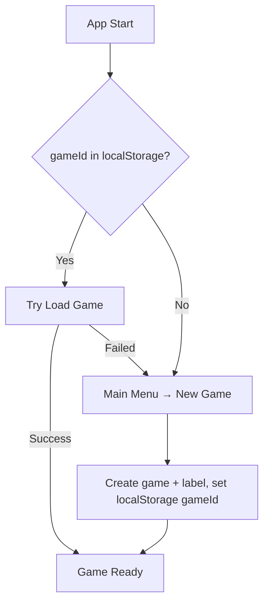

# Database Design

**Music Label Manager - Database Architecture**
*System Design Document — schema mirrors `shared/schema.ts` (Drizzle ORM)*

---

## 🗃️ Database Overview

The Music Label Manager uses **PostgreSQL** (Railway) with **Drizzle ORM** for type-safe database operations. The schema is designed for flexibility, scalability, and data integrity.

**Key Design Principles**:
- **UUID Primary Keys**: Distributed system compatibility and security
- **JSONB Storage**: Flexible data for evolving game mechanics
- **Foreign Key Integrity**: Strict relationships between entities
- **Transaction Safety**: Atomic operations for complex game state changes
- **Weekly time model**: All timeline columns are week-based (`current_week`, `signed_week`, `release_week`, …) — the game runs on a 52-week campaign

> SQL below is illustrative DDL derived from `shared/schema.ts`. That file is the source of truth; some CHECK constraints exist only in raw SQL migrations (`migrations/*.sql`) and are **not** materialized by `drizzle-kit push` (relevant for test databases).

---

## 📊 Schema Design

### **Core Tables**

#### **users** - Clerk-Linked Identities
```sql
CREATE TABLE users (
  id UUID PRIMARY KEY DEFAULT gen_random_uuid(),
  clerk_id TEXT UNIQUE NOT NULL,   -- Clerk user ID; auth happens in Clerk, not here
  email TEXT NOT NULL,
  username TEXT,
  created_at TIMESTAMP DEFAULT CURRENT_TIMESTAMP
);
```

**Purpose**: Local mirror of Clerk identities for foreign keys and game ownership
**Key Features**: No password storage — authentication is delegated entirely to Clerk (JWT verification server-side, webhook-driven user sync)

#### **game_states** - Core Game Session Data
```sql
CREATE TABLE game_states (
  id UUID PRIMARY KEY DEFAULT gen_random_uuid(),
  user_id UUID REFERENCES users(id),

  -- Game Progress
  current_week INTEGER DEFAULT 1,
  campaign_completed BOOLEAN DEFAULT FALSE,
  campaign_type TEXT DEFAULT 'Balanced',   -- Commercial, Critical, Balanced
  rng_seed TEXT,

  -- Resources (campaign start values come from data/balance:
  -- $500k money, 5 reputation, 10 creative capital — not from these column defaults)
  money INTEGER DEFAULT 75000,
  reputation INTEGER DEFAULT 0,
  creative_capital INTEGER DEFAULT 0,
  focus_slots INTEGER DEFAULT 3,           -- 4th slot unlocks at reputation >= 50
  used_focus_slots INTEGER DEFAULT 0,

  -- A&R Office
  ar_office_slot_used BOOLEAN DEFAULT FALSE,
  ar_office_sourcing_type TEXT,
  ar_office_primary_genre TEXT,
  ar_office_secondary_genre TEXT,
  ar_office_operation_start BIGINT,

  -- Access Tiers
  playlist_access TEXT DEFAULT 'none',     -- none, niche, mid, flagship
  press_access TEXT DEFAULT 'none',        -- none, blogs, mid_tier, national
  venue_access TEXT DEFAULT 'none',        -- none, clubs, theaters, arenas

  -- Flexible Data
  flags JSONB DEFAULT '{}',                -- delayed effects, A&R discovered artists, etc.
  weekly_stats JSONB DEFAULT '{}',
  tier_unlock_history JSONB DEFAULT '{}',

  -- Audit
  created_at TIMESTAMP DEFAULT CURRENT_TIMESTAMP,
  updated_at TIMESTAMP DEFAULT CURRENT_TIMESTAMP
);

CREATE INDEX idx_game_states_reputation_lookup ON game_states(id, reputation);
CREATE INDEX idx_game_states_user_reputation ON game_states(user_id, reputation, current_week);
```

**Purpose**: Central game state management
**Key Features**: Weekly progression, resource management, access tier progression, A&R operation tracking, flexible JSONB for game flags

#### **artists** - Music Artists
```sql
CREATE TABLE artists (
  id UUID PRIMARY KEY DEFAULT gen_random_uuid(),
  game_id UUID NOT NULL REFERENCES game_states(id) ON DELETE CASCADE,

  -- Identity
  name TEXT NOT NULL,
  archetype TEXT NOT NULL,          -- 'Visionary', 'Workhorse', 'Trendsetter'
  genre TEXT,
  bio TEXT,
  age INTEGER,

  -- Stats (all 0-100; CHECK constraints in migration 0020, except temperament
  -- which is constrained only in the Drizzle schema definition)
  mood INTEGER DEFAULT 50,
  energy INTEGER DEFAULT 50,
  popularity INTEGER DEFAULT 0,
  talent INTEGER DEFAULT 50,
  work_ethic INTEGER DEFAULT 50,
  stress INTEGER DEFAULT 0,
  creativity INTEGER DEFAULT 50,
  mass_appeal INTEGER DEFAULT 50,
  temperament INTEGER,
  experience INTEGER DEFAULT 0,

  -- Economic Data
  signing_cost INTEGER,
  weekly_cost INTEGER DEFAULT 1200,
  signed_week INTEGER,
  signed BOOLEAN DEFAULT FALSE,
  last_attention_week INTEGER DEFAULT 1,

  -- Mood tracking
  mood_history JSONB DEFAULT '[]',
  last_mood_event TEXT,
  mood_trend INTEGER DEFAULT 0      -- -1 declining, 0 stable, 1 improving
);

CREATE INDEX idx_artists_game_id ON artists(game_id);
```

**Purpose**: Artist roster management and relationship tracking
**Key Features**: Multi-archetype system, rich stat model, mood history, weekly economic modeling

**Important Distinction: Artist Energy vs Executive Loyalty**

The database tracks two separate relationship metrics:

- **Artist Energy** (`artists.energy`): A display-focused stat that reflects an artist's current enthusiasm. It is surfaced in UI, narrative beats, and notifications, but it does **not** alter project outcomes or economic calculations.
- **Executive Loyalty** (`executives.loyalty`): A gameplay-impacting system. Executives gain loyalty when assigned and lose it after sustained inactivity. Loyalty influences executive availability and future narrative hooks.

This separation keeps artist presentation flavorful while preserving the strategic depth of the executive relationship loop.

#### **projects** - Music Production Projects
```sql
CREATE TABLE projects (
  id UUID PRIMARY KEY DEFAULT gen_random_uuid(),
  game_id UUID NOT NULL REFERENCES game_states(id) ON DELETE CASCADE,
  artist_id UUID REFERENCES artists(id) ON DELETE CASCADE,

  -- Project Identity
  title TEXT NOT NULL,
  type TEXT NOT NULL,               -- 'Single', 'EP', 'Mini-Tour'

  -- Production Data
  stage TEXT DEFAULT 'planning',    -- planning, production, released
  quality INTEGER DEFAULT 0,
  budget INTEGER DEFAULT 0,
  budget_used INTEGER DEFAULT 0,
  budget_per_song INTEGER DEFAULT 0,
  total_cost INTEGER DEFAULT 0,
  cost_used INTEGER DEFAULT 0,
  song_count INTEGER DEFAULT 1,
  songs_created INTEGER DEFAULT 0,

  -- Economic Decision Fields
  producer_tier TEXT DEFAULT 'local',      -- local|regional|national|legendary
  time_investment TEXT DEFAULT 'standard', -- rushed|standard|extended|perfectionist

  -- Timeline
  start_week INTEGER,
  due_week INTEGER,

  -- Tour ROI tracking (mirrors song ROI system)
  total_revenue INTEGER DEFAULT 0,
  roi_percentage REAL GENERATED ALWAYS AS (
    CASE WHEN total_cost > 0
      THEN ((total_revenue - total_cost)::REAL / total_cost::REAL * 100)
      ELSE NULL END
  ) STORED,
  completion_status TEXT DEFAULT 'active', -- active, completed, cancelled

  metadata JSONB
);

CREATE INDEX idx_projects_game_id ON projects(game_id);
```

**Purpose**: Music production lifecycle management with economic decisions
**Key Features**: Multi-stage progression, budget tracking, auto-calculated tour ROI

#### **songs** - Individual Track Records
```sql
CREATE TABLE songs (
  id UUID PRIMARY KEY DEFAULT gen_random_uuid(),
  game_id UUID NOT NULL REFERENCES game_states(id) ON DELETE CASCADE,
  artist_id UUID NOT NULL REFERENCES artists(id) ON DELETE CASCADE,
  project_id UUID REFERENCES projects(id) ON DELETE SET NULL,
  release_id UUID REFERENCES releases(id) ON DELETE SET NULL,

  -- Song Identity
  title TEXT NOT NULL,
  genre TEXT,
  mood TEXT,                        -- upbeat, melancholic, aggressive, chill

  -- Production Data
  quality INTEGER NOT NULL,         -- 20-100 scale
  producer_tier TEXT DEFAULT 'local',
  time_investment TEXT DEFAULT 'standard',
  created_week INTEGER,

  -- Status Tracking
  is_recorded BOOLEAN DEFAULT FALSE,
  is_released BOOLEAN DEFAULT FALSE,
  recorded_at TIMESTAMP,
  released_at TIMESTAMP,
  release_week INTEGER,

  -- Revenue Tracking
  initial_streams INTEGER DEFAULT 0,
  total_streams INTEGER DEFAULT 0,
  total_revenue INTEGER DEFAULT 0,
  weekly_streams INTEGER DEFAULT 0,
  last_week_revenue INTEGER DEFAULT 0,

  -- Investment tracking for ROI analysis (auto-calculated)
  production_budget INTEGER DEFAULT 0,
  marketing_allocation INTEGER DEFAULT 0,
  total_investment INTEGER GENERATED ALWAYS AS (production_budget + marketing_allocation) STORED,
  roi_percentage REAL GENERATED ALWAYS AS (
    CASE WHEN (production_budget + marketing_allocation) > 0
      THEN ((total_revenue - (production_budget + marketing_allocation))::REAL
            / (production_budget + marketing_allocation)::REAL * 100)
      ELSE NULL END
  ) STORED,

  -- Awareness system (cultural penetration mechanics)
  awareness INTEGER NOT NULL DEFAULT 0,              -- 0-100 scale
  breakthrough_achieved BOOLEAN NOT NULL DEFAULT FALSE,
  peak_awareness INTEGER NOT NULL DEFAULT 0,
  awareness_decay_rate REAL NOT NULL DEFAULT 0.05,

  metadata JSONB DEFAULT '{}',      -- hooks, features, decay data
  created_at TIMESTAMP DEFAULT CURRENT_TIMESTAMP
);

-- Performance-optimized partial indexes (selection; see shared/schema.ts for all)
CREATE INDEX idx_songs_portfolio_analysis ON songs(game_id, is_recorded, producer_tier, time_investment);
CREATE INDEX idx_songs_revenue_tracking ON songs(game_id, is_released, total_revenue DESC, total_streams DESC)
  WHERE is_released = true AND total_revenue > 0;
CREATE INDEX idx_songs_weekly_revenue ON songs(release_week, last_week_revenue) WHERE release_week IS NOT NULL;
CREATE INDEX idx_songs_awareness_queries ON songs(game_id, awareness DESC, breakthrough_achieved) WHERE is_released = true;
```

**Purpose**: Individual song tracking with revenue and streaming metrics
**Key Features**: Quality calculation, weekly streaming revenue decay, auto-calculated ROI, awareness/breakthrough tracking

#### **releases** - Singles, EPs, Albums
```sql
CREATE TABLE releases (
  id UUID PRIMARY KEY DEFAULT gen_random_uuid(),
  game_id UUID NOT NULL REFERENCES game_states(id) ON DELETE CASCADE,
  artist_id UUID NOT NULL REFERENCES artists(id) ON DELETE CASCADE,

  -- Release Identity
  title TEXT NOT NULL,
  type TEXT NOT NULL,               -- single, ep, album, compilation
  release_week INTEGER,

  -- Performance Data
  total_quality INTEGER DEFAULT 0,
  marketing_budget INTEGER DEFAULT 0,
  status TEXT DEFAULT 'planned',    -- planned, released, catalog
  revenue_generated INTEGER DEFAULT 0,
  streams_generated INTEGER DEFAULT 0,
  peak_chart_position INTEGER,

  metadata JSONB DEFAULT '{}',      -- track listing, lead single strategy, etc.
  created_at TIMESTAMP DEFAULT CURRENT_TIMESTAMP
);
```

**Purpose**: Release management and performance tracking
**Key Features**: Multi-format releases, marketing integration, chart performance

#### **release_songs** - Song-Release Relationships
```sql
CREATE TABLE release_songs (
  release_id UUID NOT NULL REFERENCES releases(id) ON DELETE CASCADE,
  song_id UUID NOT NULL REFERENCES songs(id) ON DELETE CASCADE,
  track_number INTEGER NOT NULL,
  is_single BOOLEAN DEFAULT FALSE,  -- pushed as a (lead) single?

  PRIMARY KEY (release_id, song_id)
);

CREATE INDEX idx_release_songs_by_release ON release_songs(release_id, track_number);
CREATE INDEX idx_release_songs_by_song ON release_songs(song_id);
CREATE INDEX idx_release_songs_lead_singles ON release_songs(release_id) WHERE is_single = true;
```

**Purpose**: Many-to-many relationship between songs and releases
**Key Features**: Track ordering, single designation; fully captured in save snapshots (v2)

#### **weekly_actions** - Player Action History
```sql
CREATE TABLE weekly_actions (
  id UUID PRIMARY KEY DEFAULT gen_random_uuid(),
  game_id UUID NOT NULL REFERENCES game_states(id) ON DELETE CASCADE,

  week INTEGER NOT NULL,
  action_type TEXT NOT NULL,        -- 'role_meeting', 'start_project', 'marketing', etc.
  target_id UUID,                   -- role/project ID, or NULL for general actions
  choice_id UUID,                   -- for dialogue choices
  results JSONB,

  created_at TIMESTAMP DEFAULT CURRENT_TIMESTAMP
);

CREATE INDEX idx_weekly_actions_game_id ON weekly_actions(game_id);
```

**Purpose**: Player action tracking and history
**Key Features**: Choice recording, result tracking, weekly organization

### **Supporting Tables**

#### **game_saves** - Save Game System
```sql
CREATE TABLE game_saves (
  id UUID PRIMARY KEY DEFAULT gen_random_uuid(),
  user_id UUID NOT NULL REFERENCES users(id) ON DELETE CASCADE,
  name TEXT NOT NULL,
  game_state JSONB NOT NULL,        -- full snapshot (v2): gameState + sibling collections
  week INTEGER NOT NULL,
  is_autosave BOOLEAN DEFAULT FALSE,
  created_at TIMESTAMP DEFAULT CURRENT_TIMESTAMP,
  updated_at TIMESTAMP DEFAULT CURRENT_TIMESTAMP
);
```

**Purpose**: Game save/load functionality (manual saves, autosaves, export/import)
**Key Features**: `game_state` holds the versioned snapshot — `musicLabel`, `artists`, `songs`, `emails`, `executives`, etc. are **siblings of the inner `gameState`**, not nested inside it. JSON-path queries must read `game_state->'musicLabel'`. See `docs/03-workflows/save-load-system-workflow.md`.

#### **emails** - In-Game Inbox
```sql
CREATE TABLE emails (
  id UUID PRIMARY KEY DEFAULT gen_random_uuid(),
  game_id UUID NOT NULL REFERENCES game_states(id) ON DELETE CASCADE,
  week INTEGER NOT NULL,
  category TEXT NOT NULL,
  sender TEXT NOT NULL,
  sender_role_id TEXT,
  subject TEXT NOT NULL,
  preview TEXT,
  body JSONB NOT NULL,
  metadata JSONB DEFAULT '{}',
  is_read BOOLEAN NOT NULL DEFAULT FALSE,
  created_at TIMESTAMP DEFAULT CURRENT_TIMESTAMP,
  updated_at TIMESTAMP DEFAULT CURRENT_TIMESTAMP
);

CREATE INDEX idx_emails_game_id ON emails(game_id);
CREATE INDEX idx_emails_game_is_read ON emails(game_id, is_read);
CREATE INDEX idx_emails_game_week ON emails(game_id, week);
```

**Purpose**: Weekly narrative/status emails generated during week advancement; fully serialized into save snapshots

#### **executives** - Executive Team
```sql
CREATE TABLE executives (
  id UUID PRIMARY KEY DEFAULT gen_random_uuid(),
  game_id UUID NOT NULL REFERENCES game_states(id) ON DELETE CASCADE,
  role TEXT,                        -- 'head_ar', 'cmo', 'cco', 'head_distribution'
                                    -- (4 rows seeded at game creation; the schema.ts
                                    -- comment says 'head_of_ar' but seeding uses 'head_ar')
  level INTEGER DEFAULT 1,
  mood INTEGER DEFAULT 50,          -- 0-100
  loyalty INTEGER DEFAULT 50,       -- 0-100 (gameplay-impacting; see note under artists)
  last_action_week INTEGER,
  metadata JSONB
);
```

**Purpose**: Executive roster (mood/loyalty/level/salary state) driving the weekly meeting system

#### **chart_entries** - Weekly Music Charts
```sql
CREATE TABLE chart_entries (
  id UUID PRIMARY KEY DEFAULT gen_random_uuid(),
  game_id UUID NOT NULL REFERENCES game_states(id) ON DELETE CASCADE,
  song_id UUID REFERENCES songs(id) ON DELETE CASCADE,  -- NULL for competitor songs
  chart_week DATE NOT NULL,         -- weekly snapshot date (52 charts per campaign)
  streams INTEGER NOT NULL,
  position INTEGER,                 -- 1-100+, NULL if not charting
  is_charting BOOLEAN GENERATED ALWAYS AS (position IS NOT NULL AND position <= 100) STORED,
  is_debut BOOLEAN DEFAULT FALSE,
  movement INTEGER DEFAULT 0,       -- position change vs previous week
  is_competitor_song BOOLEAN DEFAULT FALSE,
  competitor_title TEXT,
  competitor_artist TEXT,
  created_at TIMESTAMP DEFAULT CURRENT_TIMESTAMP
);

-- Idempotency: unique per (game, song, week) for player songs;
-- unique per (game, week, title, artist) for competitor songs
CREATE UNIQUE INDEX idx_chart_entries_unique_player ON chart_entries(game_id, song_id, chart_week);
CREATE UNIQUE INDEX idx_chart_entries_unique_competitor ON chart_entries(game_id, chart_week, competitor_title, competitor_artist)
  WHERE song_id IS NULL;
```

**Purpose**: Weekly Top 100 chart snapshots mixing player songs and generated competitor songs

#### **music_labels** - Player Label Identity
```sql
CREATE TABLE music_labels (
  id UUID PRIMARY KEY DEFAULT gen_random_uuid(),
  game_id UUID NOT NULL UNIQUE REFERENCES game_states(id) ON DELETE CASCADE,
  name TEXT NOT NULL,
  founded_week INTEGER DEFAULT 1,
  founded_year INTEGER,
  description TEXT,
  genre_focus TEXT,
  created_at TIMESTAMP DEFAULT CURRENT_TIMESTAMP
);
```

**Purpose**: One label per game — name/branding created via LabelCreationModal, used for autosave naming

#### **mood_events** - Artist Mood History
```sql
CREATE TABLE mood_events (
  id UUID PRIMARY KEY DEFAULT gen_random_uuid(),
  game_id UUID NOT NULL REFERENCES game_states(id) ON DELETE CASCADE,
  artist_id UUID REFERENCES artists(id) ON DELETE CASCADE,  -- NULL for global events
  event_type TEXT NOT NULL,         -- 'release_success', 'neglected', ...
  mood_change INTEGER NOT NULL,
  mood_before INTEGER NOT NULL,
  mood_after INTEGER NOT NULL,
  description TEXT NOT NULL,
  week_occurred INTEGER NOT NULL,
  metadata JSONB DEFAULT '{}',
  created_at TIMESTAMP DEFAULT CURRENT_TIMESTAMP
);
```

**Purpose**: Historical mood change log powering weekly summaries and the mood targeting system (global vs per-artist scopes)

#### **Other tables**
- **`roles`** — industry role relationships per game (name, title, type, relationship 0-100, access_level)
- **`dialogue_choices`** — dialogue choice definitions with immediate/delayed effect JSONB
- **`game_events`** — side-story event definitions with trigger conditions and choices

---

## 🔗 Relationships and Constraints

### **Primary Relationships**
```
users (1) ──── (n) game_states
users (1) ──── (n) game_saves
game_states (1) ──── (1) music_labels
game_states (1) ──── (n) artists / projects / songs / releases / emails /
                          executives / chart_entries / weekly_actions / mood_events / roles
artists (1) ──── (n) projects, songs, releases, mood_events
projects (1) ──── (n) songs                  [ROI tracking]
releases (n) ──── (n) songs                  [via release_songs]
songs (1) ──── (n) chart_entries             [player songs; competitor entries have NULL song_id]
```

### **Key Constraints**
- **Cascading Deletes**: Game deletion removes all associated data
- **Set Null**: Song's `project_id`/`release_id` survive project/release deletion
- **Foreign Key Integrity**: All relationships enforced at database level
- **Check Constraints**: Artist stats 0-100 — migration `0020_add_artist_attribute_constraints.sql` covers mood, energy, talent, work_ethic, stress, creativity, mass_appeal (temperament is constrained only in the Drizzle schema, not in 0020). `drizzle-kit push` does not create these raw-SQL constraints, so test databases must apply `migrations/*.sql` (at least `0020`)
- **Generated Columns**: `songs.total_investment`, `songs.roi_percentage`, `projects.roi_percentage`, `chart_entries.is_charting` are computed by PostgreSQL

---

## 📈 Performance Considerations

### **Indexing Strategy**
- **Game Queries**: `game_id` indexes on every per-game table for fast load and save/restore
- **Weekly Processing**: Efficient project and song updates during `advanceWeek`
- **Revenue Calculations**: Partial indexes on released songs for decay and ROI queries
- **Charts**: Composite indexes on `(game_id, chart_week, position)` for Top 100 retrieval
- **Inbox**: `(game_id, is_read)` for unread counts

### **JSONB Usage**
- **Flexible Metadata**: Song attributes, project details, game flags, email bodies
- **A&R Discoveries**: Discovered artists persisted in `game_states.flags.ar_office_discovered_artists`
- **Evolution**: Schema flexibility for new game mechanics

### **Query Patterns**
- **Game Load**: Per-table queries by `game_id` (indexed)
- **Weekly Advance**: Batch updates with transaction safety
- **Revenue Decay**: Efficient weekly streaming revenue calculations
- **Save System**: Complete snapshot serialization into `game_saves.game_state`

---

## 🔧 Data Integrity

### **Transaction Patterns**
- **Week Advancement**: All calculations in a single transaction
- **Project Creation**: Atomic budget/creative-capital deduction and resource allocation
- **Artist Signing**: Coordinated cost management and roster updates
- **Save/Restore**: Consistent snapshots; restore deletes children before parents (dependency-safe order), fork mode remaps IDs while preserving relationships

### **Validation Rules**
- **Resource Limits**: Money, reputation, creative capital bounds (creative capital >= 1 required for project creation and release planning)
- **Timeline Consistency**: Project start/due weeks logical ordering
- **Relationship Integrity**: Artist-project-song associations maintained
- **Quality Bounds**: Song and project quality within valid ranges
- **Snapshot Versioning**: `SNAPSHOT_VERSION` (`shared/schema.ts`) gates restore; mismatched versions are rejected or migrated

---

## 🎮 Game State Management

### **Game Lifecycle**

```mermaid
graph TD
    A[App Start] --> B{gameId in localStorage?}
    B -->|Yes| C[Try Load Game]
    B -->|No| G[Main Menu → New Game]
    C -->|Success| D[Game Ready]
    C -->|Failed| G
    G --> E[Create game + label, set localStorage gameId]
    E --> D[Game Ready]
```

### **Database Management Strategy**
- **Multiple Games**: Users can maintain multiple active games simultaneously
- **Manual Saves**: SaveGameModal for named saves, export/import as JSON files
- **Autosaves**: Created on week advancement with label-based naming; retention keeps the most recent autosaves per game
- **Admin Cleanup**: Orphaned games removable via admin endpoint / `npm run db:cleanup-orphaned`

### **State Synchronization**
```javascript
// GameContext + gameStore synchronization
localStorage.setItem('currentGameId', newGameId);  // GameContext
set({ gameState: newGameState });                  // gameStore (Zustand)
```

### **Multi-User Posture**
- Game ownership validated on every authenticated route (Clerk user → local user → game)
- Per-user save management already implemented
- Database schema supports full multi-user scaling

---

*This database design supports the complete Music Label Manager simulation with performance, scalability, and data integrity as core principles.*
