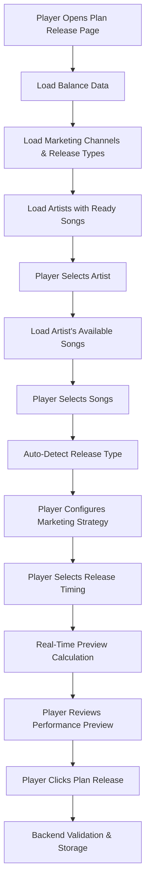

# Plan Release System Workflows

**Comprehensive guide to release planning, preview, and execution workflows**

*Audience: Developers, Product Managers*
*Purpose: Understanding release planning processes and user journeys*
*Created: September 24, 2025*

---

## 🎯 **Overview**

The Plan Release System enables players to schedule strategic music releases with sophisticated marketing allocation, seasonal timing optimization, and lead single strategies. This document maps the complete workflow from release planning through execution.

## 📋 **Plan Release System Components**

### **Frontend Components**
- `PlanReleasePage.tsx` (1293 lines) - Complete release planning interface
- `WeekPicker` - Seasonal timing selection with visual feedback
- Dynamic balance data loading with hard-fail error handling

### **Backend Systems**
- `/api/game/:gameId/releases/plan` - Release scheduling and budget deduction
- `/api/game/:gameId/releases/preview` - Real-time performance calculations
- `/api/game/:gameId/balance` - Dynamic balance configuration loading
- `GameEngine.processPlannedReleases()` - Release execution during week advancement
- `GameEngine.calculateSophisticatedReleaseOutcome()` - Actual performance calculation

### **Configuration Data**
- `data/balance/markets.json` - Release formulas, seasonal multipliers, channel effectiveness
- `shared/utils/seasonalCalculations.ts` - Shared seasonal logic
- `shared/utils/marketingUtils.ts` - Marketing channel and release type configuration

---

## 🔄 **Complete Release Planning Workflow**

### **Phase 1: User Interface Flow**



### **Phase 2: Release Configuration Process**

#### **2.1 Artist & Song Selection**
```
User Action: Select Artist
     ↓
API Call: GET /api/game/{gameId}/artists/ready-for-release
     ↓
Response: Artists with recordedSongs > 0 AND releasedSongs count
     ↓
User Action: Select Songs
     ↓
API Call: GET /api/game/{gameId}/artists/{artistId}/songs/ready
     ↓
Response: Songs where isRecorded=true AND releaseId=null
     ↓
Auto-Detection: Release type based on song count (1=single, 3-5=EP, 8+=album)
```

#### **2.2 Marketing Strategy Configuration**
```
User Action: Adjust Channel Budget Sliders (radio, digital, pr, influencer)
     ↓
Real-Time Calculation: Channel synergies, diversity bonuses
     ↓
Display: Effectiveness percentages, target audiences, synergy warnings
     ↓
Lead Single Strategy (multi-song releases only):
     ↓
User Action: Select lead single, set lead single week, allocate lead single budget
```

#### **2.3 Seasonal Timing Selection**
```
User Action: Select Release Week via WeekPicker
     ↓
Calculation: getSeasonFromWeek(week) → Quarter (Q1-Q4)
     ↓
Seasonal Multiplier: Q1=0.85 (-15%), Q2=0.95 (-5%), Q3=1.1 (+10%), Q4=1.4 (+40%)
     ↓
Visual Feedback: Quarter display, cost impact preview, optimal timing guidance
```

### **Phase 3: Real-Time Preview System**

#### **3.1 Debounced Preview Calculation**
```
Input Changes (500ms debounce) → API Call → GameEngine → Response → UI Update
        ↓                            ↓           ↓            ↓          ↓
Channel budgets,              POST /releases/  calculate     Preview    Performance
timing, songs                 preview          ReleasePreview data      metrics update
```

#### **3.2 Preview API Processing**
**Location**: `server/routes.ts:1474`
```typescript
const previewResults = gameEngine.calculateReleasePreview(
  releaseSongs,
  artist,
  releaseConfig
);
```

**Key Features**:
- **Same calculation engine** as actual release execution
- **Real variance applied** (±10% RNG on base streams)
- **Exact seasonal multipliers** from selected week
- **Actual marketing synergies** from channel allocation

#### **3.3 Preview Calculation Chain**
```
calculateReleasePreview() → calculateStreamingOutcome() → ±10% Variance → Multipliers Applied
           ↓                         ↓                         ↓                ↓
Uses song quality,            Base streams calculation     RNG variance      Final streams
marketing budget,             (quality + playlist +        (0.9 to 1.1)     × release type
seasonal timing,              reputation + marketing                         × seasonal
release type                  + popularity)                                  × marketing
```

### **Phase 4: Release Planning Validation & Storage**

#### **4.1 Frontend Validation**
```
validateRelease() checks:
├── Artist selected
├── Songs selected (min 1, EP ≥3, Album ≥8)
├── Release title entered
├── Marketing budget ≤ available funds
├── At least one marketing channel has budget > 0
├── Lead single timing (if applicable): leadWeek < releaseWeek, gap ≤ 3 weeks
└── Channel budgets within min/max constraints
```

#### **4.2 Backend Storage Process**
**Location**: `server/routes.ts:1588-1631`

```
Database Transaction:
├── Budget Validation: totalBudget ≤ gameState.money
├── Song Conflict Check: No songs already in other planned releases
├── Money Deduction: gameState.money -= totalBudget (SINGLE deduction - fixed)
├── Release Record Creation:
│   ├── Basic data: title, type, artistId, releaseWeek
│   ├── Marketing budget: total amount + per-channel breakdown
│   └── Metadata: seasonalTiming, scheduledReleaseWeek,
│       marketingBudgetBreakdown, leadSingleStrategy
├── Song Reservation: Update songs.releaseId = newRelease.id
└── Junction Table: Create release_songs entries with track numbers
```

### **Phase 5: Release Execution During Week Advancement**

#### **5.1 Execution Trigger**
**Location**: `game-engine.ts:167`
```
Weekly Advancement Process:
├── Process executive actions
├── Process ongoing projects
├── → processPlannedReleases() ← [RELEASE EXECUTION HAPPENS HERE]
├── Process weekly charts
└── Calculate weekly financials
```

#### **5.2 Release Execution Logic**
**Location**: `game-engine.ts:1087-1190`

```
For each planned release where releaseWeek === currentWeek:
├── Load release metadata (marketing budget breakdown, seasonal timing)
├── Get associated songs via release_songs junction table
├── Reconstruct marketing budget from stored marketingBudgetBreakdown
├── Call calculateSophisticatedReleaseOutcome():
│   ├── Uses SAME calculateReleasePreview() method as UI preview
│   ├── Applies ±10% RNG variance (different seed than preview)
│   ├── Applies seasonal multipliers from stored week
│   ├── Applies marketing synergies from stored channel allocation
│   ├── Applies release type bonuses (Single +20%, EP +15%, Album +25%)
│   └── Returns per-song breakdown proportional to song quality
├── Update songs: isReleased=true, initialStreams, weeklyStreams, totalRevenue
├── Track marketing investment via InvestmentTracker
├── Update release status to 'released'
└── Add to WeekSummary for player feedback
```

#### **5.3 Variance Behavior**
```
Preview RNG Seed: gameState.id + selectedWeek (when calculating preview)
Execution RNG Seed: gameState.id + currentWeek (when release executes)
           ↓                                 ↓
Preview variance: ±10%               Execution variance: ±10% (different result)
```

**Impact**:
- **Preview**: Shows estimated performance with realistic variance
- **Execution**: Applies different variance for realism - actual results may differ ±10% from preview
- **Realistic Gameplay**: Represents unpredictable nature of music industry

### **Phase 6: Results & Player Feedback**

#### **6.1 Week Summary Display**
```
WeekSummary contains:
├── revenue: Total revenue from all releases this week
├── streams: Total streams from all releases this week
├── changes: Array of release events with song details
└── chartUpdates: New chart entries from released songs
```

#### **6.2 Long-term Revenue Tracking**
```
Released songs continue generating revenue via:
├── Weekly decay: 85% of previous week's streams
├── Ongoing revenue: weeklyStreams × $0.05 per stream
├── Maximum duration: 24 weeks of ongoing revenue
└── Total accumulation: song.totalRevenue tracks lifetime earnings
```

---

## 🎯 **Key Technical Achievements**

### **Data Consistency**
- ✅ **Single calculation engine**: Preview and execution use identical methods
- ✅ **Exact budget preservation**: Per-channel allocations stored and restored
- ✅ **Seasonal accuracy**: Timing effects calculated from stored week data
- ✅ **Marketing integrity**: Channel synergies preserved through execution

### **Variance & Realism**
- ✅ **Realistic uncertainty**: ±10% variance on all streaming calculations
- ✅ **Seeded randomness**: Deterministic variance per week for testing
- ✅ **Preview vs execution**: Different seeds create realistic unpredictability

### **Configuration-Driven**
- ✅ **Dynamic balance loading**: All multipliers from `data/balance/markets.json`
- ✅ **Hard-fail validation**: No silent fallbacks to hardcoded values
- ✅ **Single source of truth**: Shared utilities eliminate configuration drift

---

**This workflow ensures complete data consistency between player expectations (preview) and actual game outcomes (execution), while maintaining realistic variance that represents music industry unpredictability.**

*Updated: September 24, 2025 - Post data consistency fixes and marketing efficiency removal*